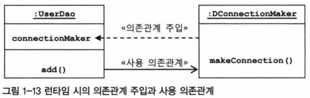

**의존관계 주입(DI)**
스프링의 IoC에 대해 좀 더 깊이 알아보자.

### 제어의 역전(IoC)과 의존관계 주입
객체를 생성하고 관계를 맺어주는 등의 작업을 담당하는 기능을 일반화한 것이 스프링의 IoC컨테이너

스프링은 IoC컨테이너다. => 매우 느슨한 정의
1. 스프링이 서블릿 컨테이너처럼 서버에서 동작하는 서비스 컨테이너라는 뜻
2. 단순히 IoC 개념이 적용된 템플릿 메서드 패턴을 이용해 만들어진 프레임워크
3. 또 다른 IoC특징을 지닌 기술
이렇게 의도가 명확하지 않음.

=> 스프링이 제공하는 IoC방식의 핵심 = 의존관계 주입 DI (Dependency Injection)
즉, 스프링 IoC 기능의 대표적인 동작원리는 주로 의존관계 주입이라고 불림.

스프링이 컨테이너이고 프레임워크이니 기본적인 동작원리가 모두 IoC방식 + 의존관계 주입(차별화된 기능)

요새는 의존관계 주입 컨테이너 또는 DI 컨테이너라고도 많이 불림.

### 런타임 의존관계 설정
#### 의존관계
두 개의 클래스 또는 모듈이 의존관계에 있다고 말할 때는 항상 방향성을 부여해줘야 한다.
누가 누구에게 의존하는 관계에 있다.

A가 B에 의존하고 있다.


의존하고 있다 = 의존대상(B)이 변하면 그것이 A에 영향을 미친다.
B의 기능이 추가되거나 변경되거나, 형식이 바뀌거나 하면 그 영향이 A로 전달된다는 것.

A가 B를 사용하는 경우, 예를 들어 A에서 B에 정의된 메서드를 호출해서 사용하는 경우
'사용에 대한 의존관계'가 있다.
만약 B에 새로운 메서드가 추가되거나 기존 메서드의 형식이 바뀌면 A도 그에 따라 수정되거나 추가돼야함.
또는 B의 형식은 그대로지만 기능이 내부적으로 변경되면, 결과적으로 A의 기능이 수행되는 데도 영향을 미칠 수 있음.
이렇게 사용의 관계가 있는 경우, A와 B는 의존관계가 있다고 말할 수 있음.

**의존관계에는 방향성이 있다.**
A가 B에 의존하고 있지만, B는 A에 의존하지 않는다.
즉, B는 A의 변화에 영향을 받지 않음.

#### UserDao의 의존관계
인터페이스에 대해서만 의존관계를 만들어두면 인터페이스 구현 클래스와의 관게는 느슨해지면서
변화에 영향을 덜 받는 상태가 된다.

결합도가 낮다.

인터페이스를 통해 의존관계를 제한해주면 그만큼 변경에서 자유로워진다.

UML에서 말하는 의존관계란 이처럼 설계 모델의 관점에서 이야기 하는 것이다.
그런데 모델이나 코드에서 클래스와 인터페이스를 통해 드러나는 의존관계 말고,

---
런타임 시에 오브젝트 사이에서 만들어지는 의존관계도 있다.
= 런타임 의존관계 = 오브젝트 의존 관계
설계시점의 의존관계가 실체화 된 것.

===> 런타임 의존관계는 모델링 시점의 의존관계와 성격이 분명히 다름.

인터페이스를 통해 설계시점에 느슨한 의존관계를 갖는 경우에는 UserDao의 오브젝트가 런타임 시에 사용할 오브젝트가 어떤 클래스로 만든 것인지 미리 알 수가 없음.
프로그램이 시작되고 UserDao오브젝트가 만들어지고 나서 런타임 시에 의존관계를 맺는 대상, 즉 실제 사용대상인 오브젝트를 의존오브젝트 dependent object라고 말한다.

**의존관계 주입** 은 이렇게 구체적인 의존오브젝트와 그것을 사용할 주체(보통 클라이언트라고 부르는 오브젝트)를 런타임 시에 연결해주는 작업을 말한다.

UserDao는 ConnectionMaker인터페이스라는 매우 단순한 조건만 만족하면 어떤 클래스로부터 만들어졌든 상관없이 오브젝트를 받아들이고 사용한다.

의존관계 주입 = 다음 3가지 조건을 충족하는 작업
1. 클래스 모델이나 코드에는 런타임 시점의 의존관계가 드러나지 않는다. ( => 그러기 위해서는 인터페이스에만 의존하고 있어야 한다.)
2. 런타임 시점의 의존관계는 컨테이너나 팩토리 같은 제 3의 존재가 결정한다.
3. 의존관계는 사용할 오브젝트에 대한 레퍼런스를 외부에서 제공(주입)해줌으로써 만들어진다.

의존관계 주입의 **핵심**
설계시점에는 알지 못했던 두 오브젝트의 관계를 맺도록 도와주는 제3의 존재가 있다는 것.
DI에서 말하는 제3의 존재는 관계설정 책임을 가지는 코드를 분리해서 만들어진 오브젝트다.
DaoFactory와 같은 작업을 일반화해서 만들어졌다는 스프링의 애플리케이션 컨텍스트, 빈 팩토리, IoC컨테이너 등이 모두 외부에서 오브젝트 사이의 런타임 관계를 맺어주는 책임을 지닌 제 3의 존재임.

#### UserDao의 의존관계 주입
런타임 시의 의존관계가 코드 속에 다 미리 결정되어 있다는 문제점.
-> IoC방식을 써서 UserDao로부터 런타임 의존관계를 드러내는 코드를 제거하고, 제3의 존재에 런타임 의존관계 결정 권한을 위임한다.

보통 DI는 그 근간이 되는 개념인 IoC와 함께 사용해서 IoC/DI 컨테이너라는 식으로 함께 사용하기도 한다.

DI 컨테이너는 UserDao를 만드는 시점에서 생성자의 파라미터로 이미 만들어진 DConnectionMaker의 오브젝트를 전달한다.
정확히는 DConnectionMaker 오브젝트의 레퍼런스가 전달되는 것이다. 주입이라는 건 외부에서 내부로 무엇인가를 넘겨줘야 하는
것인데, 자바에서 오브젝트에 무엇인가를 넣어준다는 개념은 메서드를 실행하면서 파라미터로 오브젝트의 레퍼런스를 전달해주는 방법뿐이다.
가장 손쉽게 사용할 수 있고, 파라미터 전달이 가능한 메서드는 **생성자** 다.
생성자 파라미터를 통해 전달받은 런타임 의존관계를 갖는 오브젝트는 인스턴스 변수에 저장해둔다.


DI는 자신이 사용할 오브젝트에 대한 선택과 생성 제어권을 외부로 넘기고 자신은 수동적으로
주입받은 오브젝트를 사용한다는 점에서 IoC의 개념에 잘 들어맞는다.

### 의존관계 검색과 주입
스프링이 제공하는 IoC방법에는 의존관계 주입만 있는 것이 아님.
의존관계를 맺는 방법이 외부로부터의 주입이 아니라 스스로 검색을 이용하기 때문에
**의존관계 검색dependency lookup** 이라고 불리는 것도 있음.
자신이 필요로 하는 의존 오브젝트를 능동적으로 찾는다.
자신이 어떤 클래스의 오브젝트를 이용할지 결정하지는 않는다. 그러면 IoC라고 할 수 없으므로.
즉, 외부 컨테이너가 IoC로서 런타임 시 의존관계를 맺을 오브젝트를 결정하고 해당 오브젝트를 생성하게 하고,
이를 가져올 때 메서드나  생성자를 통한 주입이 아니라 스스로 컨테이너에게 요청하는 방법을 사용하는 것이
의존관계 검색임.

애플리케이션 컨텍스트를 사용해서 의존관계 검색 방식으로 ConnectionMaker오브젝트를 가져옴.
```java
public UserDao() {
    AnnotationConfigApplicationContext context = new AnnotationConfigApplicationContext(DaoFactory.class);

    this.connectionMaker = context.getBean("connectionMaker",ConnectionMaker.class);
}
```
의존관계 검색은 기존 의존관계 주입의 거의 모든 장점을 갖고 있음.
방법만 조금 다를 뿐 IoC원칙에도 잘 들어맞음.

의존관계 검색과 의존관계 주입 중 어떤 것이 더 나음?
-> 코드를 보면 느낄 수 있음. 의존관계 주입 쪽이 훨씬 단순하고 깔끔함.

의존관계 검색 방법은
코드 안에 오브젝트 팩토리 클래스나 스프링 API(예. getBean())가 나타난다.
=> 애플리케이션 컴포넌트가 컨테이너와 같이 성격이 다른 오브젝트에 의존하게 되는 것이므로 그다지 바람직하지 않음.
  사용자에 대한 DB 정보를 어떻게 가져올 것인가에 집중해야 하는 UserDao에서 스프링이나 오브젝트 팩토리를 만들어놓고
  API를 이용하는 코드가 섞여 있는 것은 어색함.

따라서, **대개는 의존관계 주입 방식을 사용하는 편이 낫다.**

그런데 의존관계 검색방식을 사용해야 할 때가 있음.
스프링의 IoC와 DI컨테이너를 적용했다고 하더라도 애플리켘이션 기동시점에서 적어도 한 번은 의존관계 검색방식을
사용해 오브젝트를 가져와아 한다.
static method인 main()에서는 DI를 이용해 오브젝트를 주입받을 방법이 없기 때문임.
서버에서도 마찬가지.
서버에는 main()과 같은 기동 메서드는 없지만, 사용자의 요청을 받을 때마다 main() 메서드와 비슷한 역할을 하는
서블릿에서 스프링 컨테이너에 담긴 오브젝트를 사용하려면 한 번은 의존관계 검색 방식을 사용해
오브젝트를 가져와야 한다.

다행히 이런 서블릿은 스프링이 미리 만들어서 제공하기 때문에 직접 구현할 필요는 없음.

```
* 중요한 차이점
의존관계 검색 vs 의존관계 주입

: 의존관계 검색 방식에서는 검색하는 오브젝트는 자신이 스프링의 빈일 필요가 없다는 점.
즉, UserDao에 스프링의 getBean()을 사용한 의존관계 검색 방법을 적용했다고 해보자.
이 경우 UserDao는 굳이 스프링이 만들고 관리하는 빈일 필요가 없다.

그냥 어딘가에서 직접 new UserDao() 해서 만들어서 사용해도 된다.
ConnectionMaker만 스프링의 빈이기만 하면 됨.

: 반면, 의존관계 주입에서는 UserDao와 ConnectionMaker 사이에 DI가 적용되려면 UserDao도
반드시 컨테이너가 만드는 빈 오브젝트여야 한다.

컨테이너가 UserDao에 ConnectionMaker 오브젝트를 주입해주려면 UserDao에 대한 생성과
초기화 권한을 갖고 있어야 하고, 그러려면 UserDao는 IoC방식으로 컨테이너에서 생성되는 오브젝트,
즉 빈이어야 하기 때문이다. 이런 점에서 DI와 DL(의존관계 검색의 약자)은 적용방법에 차이가 있다.
=> DI를 원하는 오브젝트는 먼저 자기 자신이 컨테이너가 관리하는 빈이 돼야 한다.

```

### 의존관계 주입의 응용
DI기술(런타임 시에 사용 의존관계를 맺을 오브젝트를 주입해준다)의 장점?
- 코드에는 런타임 클래스에 대한 의존관계가 나타나지 않고, 인터페이스를 통해 결합도가 낮은 코드를 만드므로,
다른 책임을 가진 사용 의존관계에 있는 대상이 바뀌거나 변경되더라도 자신은 영향받지 않으며, 변경을 통한 다양한
확장 방법에는 자유롭다.

* UserDao가 ConnectionMaker라는 인터페이스에만 의존하고 있다는 건,
ConnectionMaker를 구현하기만 하고 있다면 어떤 오브젝트든지 사용할 수 있다는 뜻.

#### 기능 구현의 교환
실제 운영에 사용할 데이터베이스는 매우 중요한 자원.
평상시에도 항상 부하를 많이 받고 있어서 개발 중에는 절대 사용하지 말아야 함.

대신 개발 중에는 개발자 PC에 설치한 로컬 DB로 사용해야 한다.
개발이 진행되다가 어느 시점이 되면 지금까지 개발한 것을 그대로 운영서버로 배치해서 사용할 것이다.
**그런데 만약 DI방식을 적용하지 않았다고 하면,**

개발 중
로컬 DB를 사용하도록 해야하니 로컬 DB에 대한 연결기능이 있는 LocalDBConnecctionMaker라는 클래스를 만들고,
모든 DAO에서 이 클래스의 오브젝트를 매번 생성해서 사용하게 했을 것(초난감DAO)

서버에 배포할 때
서버가 제공하는 특별한 DB연결 클래스를 사용해야한다.
DI를 안했으니 현재 모든 DAO는 코드에서 이미 LocalDBConnectionMaker클래스에 의존하고 있음.
(new LocalDBConnecctionMaker라는 코드가 모든 DAO에 들어있다.)
이를 서버에 배치하는 시점에서 운영서버에서 DB에서 연결할 때 필요한 ProductionDBConnectionMaker라는 클래스로
변경해줘야 한다. DAO가 100개라면 최소 100군데의 코드를 수정해야함.

다시 개발하려고 하면 또다시 수정해야함. => 끔찍

반면, **DI 방식을 적용해서 만들었다고 하면**
모든 DAO는 생성 시점에 ConnectionMaker 타입의 오브젝트를 컨테이너로부터 제공받는다.
구체적인 사용 클래스 이름은 컨테이너가 사용할 설정정보에 들어 있다.

 @Configuration 을 붙일 클래스의 코드만 변경해주면 됨.
 개발용에서
 ```Java
 @Bean
 public ConnectionMaker connectionMaker() {
      return new LocalDBConnectionMaker();
 }
 ```

운영용에서
 ```Java
 @Bean
 public ConnectionMaker connectionMaker() {
      return new ProductionDBConnectionMaker();
 }
 ```
딱 한줄만 고치면 됨.
QA팀이 테스트용으로 별도의 테스트 DB를 만들어서, 개발한 코드를 테스트 할때 쓴다고 해도
DAO코드에는 전혀 손댈 필요가 없음. 단지 테스트 DB에 접속하는 방법을 가진 ConnectionMaker구현 클래스를 만들고,
그것을 테스트에서 사용할 DaoFactory(@Configuration)설정에 넣어주기만 하면 됨.
테스트가 수행되는 시점에서 (다이나믹하게) 테스트용 DB에 연결해주는 오브젝트를 DI컨테이너가 만들어 모든 DAO가
사용할 수 있도록 DI해줄 것임.

#### 부가기능 추가
DAO가 DB를 얼마나 많이 연결해서 사용하는지 파악하고 싶다

DB연결횟수를 카운팅하는 무식한 방법
모든 DAO의 makeConnection() 메서드 호출하는 부분에 새로 추가한 카운터를 증가시키는 코드를 넣는다.
분석작업이 끝나면 모두 제거한다.
=> 시간낭비임. DAO 코드 수정하는 건 피하자. 또한 DB연결 횟수 세는 건 DAO의 관심사항도 아님..

DI 컨테이너에서는 아주 간단한 방법으로 가능함.
DAO와 DB커넥션을 만드는 오브젝트 사이에 연결횟수를 카운팅하는 오브젝트를 하나 더 추가하는 것임.
DI를 이용하므로 기존 코드 수정할 필요 없음.
컨테이너가 사용하는 설정정보만 수정해서 런타임 의존관계만 새롭게 정의해주면 됨.

DI의 장점은 관심사의 분리SoC(Separation of Concerns)를 통해 얻어지는 높은 응집도에서 나옴.

스프링은 DI를 편하게 사용할 수 있도록 도와주는 도구이면서 그 자체로 DI를 적극 활용한 프레임워크이기도 함.
스프링을 공부한다 = DI를 어떻게 활용해야 할지 공부한다.

#### 메서드를 이용한 의존관계 주입

UserDao의 의존관계 주입을 위해 생성자를 사용
(생성자에 파라미터를 만들어두고 이를 통해 DI컨테이너가 의존할 레퍼런스를 넘겨주도록 만들었음)

하였으나 의존관계 주입 시 반드시 생성자를 사용해야 하는 것은 아님.
일반 메서드를 사용할 수 있고 뿐만 아니라, 오히려 이 방법이 더 자주 사용됨.

일반메서드를 이용해 의존 오브젝트와의 관계를 주입해주는 방법은 2가지
1. 수정자 setter 메서드를 이용한 주입

외부에서 오브젝트 내부의 애트리뷰트 값을 변경하려는 용도로 주로 사용된다.
메서드는 항상 set으로 시작한다. 간단히 수정자라고 불리기도 함.
수정자 메서드의 핵심 기능은 파라미터로 전달된 값을 보통 내부의 인스턴스 변수에 저장하는 것임.
부가적으로, 입력 값에 대한 검증이나 그 밖의 작업을 수행할 수도 있음.
수정자 메서드는 외부로부터 제공받은 오브젝트 레퍼런스를 저장해뒀다가
내부의 메서드에서 사용하게 하는 DI방식에서 활용하기에 적당함.

2. 일반 메서드를 이용한 주입

수정자 메서드처럼 set으로 시작해야하고 한 번에 한개의 파라미터만 가질 수 있는 제약이 싫다면!

**여러 개의 파라미터를 갖는 일반 메서드를 DI용으로 사용할 수 있다.**

생성자가 수정자 메서드보다 나은 점은 한 번에 여러 개의 파라미터를 받을 수 있다는 점이다.
하지만 파라미터의 개수가 많아지고 비슷한 타입이 여러 개라면 실수하기 쉽다.

**임의의 초기화 메서드를 이용하는 DI는 적절한 개수의 파라미터를 가진 여러 개의 초기화 메서드를 만들 수도 있기 때문에**
한 번에 모든 필요한 파라미터를 다 받아야 하는 생성자보다 낫다.


스프링은 전통적으로 메서드를 이용한 DI 방법중에서 수정자 메서드를 가장 많이 사용해왔다.
자바 코드 대신 XML을 사용하는 경우에는 자바빈 규약을 따르는 수정자 메서드가 가장 사용하기 편리하다.

수정자 메서드 DI를 사용할 때는 메서드의 이름을 잘 결정하는 게 중요하다. 가능한 의미있고 단순한 이름을 사용할 것.
메서드를 통해 DI 받을 오브젝트 타입 이름을 따르는 것이 가장 무난함.
```Java
예를 들어, ConnectionMaker 인터페이스 타입의 오브젝트를 DI 받을 경우

메서드 이름 => setConnectionMaker()
```
