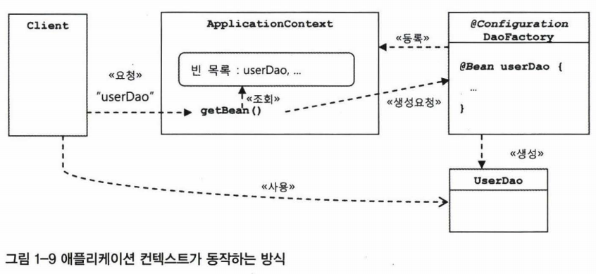

1
---

UserDao를
ConnectionMaker 인터페이스를 구현한 특정 클래스(ex. DConnectionMaker)로부터
완전히 독립시킴
  ```java
  public class UserDao {
      private ConnectionMaker connectionMaker;

      public UserDao(){
          connectionMaker = new DConnectionMaker(); // 여기!!
      }

      public void add(User user) throws ClassNotFoundException, SQLException {
          Connection c = connectionMaker.makeConnection();
      }
  }
  ```
  <p align="center">
  <br>
  </p>

  UserDao와 UserDao가 사용할 ConnectionMaker의 특정 구현 클래스 사이의 **관계를 설정해주는 관심사를 분리** 했다.

  ```java
  public class UserDao {
      private ConnectionMaker connectionMaker;

      public UserDao(ConnectionMaker connectionMaker){
          this.connectionMaker = connectionMaker; // 여기!!
      }

      public void add(User user) throws ClassNotFoundException, SQLException {
          Connection c = connectionMaker.makeConnection();
      }
  }
  ```
  그리고 이 책임(관계설정 책임)을 클라이언트(UserDaoTest)에게 떠넘겼다.
  ```java
  public class UserDaoTest {
      public static void main(String[] args) throws ClassNotFoundException, SQLException {
          ConnectionMaker connectionMaker = new NConnectionMaker(); // 여기!!

          UserDao dao = new UserDao(connectionMaker);
      }
  }
  ```

  2
  ---
  UserDaoTest의 관심사는 테스트인데 관계설정책임까지 떠맡고 있다. 분리해주자.
  > - 관계설정 책임
  >   - UserDao클래스의 오브젝트 만들기
  >   - ConnectionMaker구현 클래스의 오브젝트 만들기
  >   - 만들어진 두 개의 오브젝트가 연결돼서 사용되도록 관계 맺어주기

## 팩토리

객체의 생성 방법을 결정하고 그렇게 만들어진 오브젝트를 돌려주는 역할을 하는 클래스의 오브젝트를 흔히 Factory라 부른다.

오브젝트를 생성하는 쪽과 생성된 오브젝트를 사용하는 쪽의 역할과 책임을 깔끔하게 분리하려는 목적으로 팩토리를 사용한다.
> 디자인패턴에서 말하는 추상 팩토리 패턴이나 팩토리 메서드 패턴과 혼동하지 말 것!

```java
public class DaoFactory {

    // UserDao타입의 오브젝트를 어떻게 만들고, 어떻게 준비시킬지 결정하는 팩토리의 메서드
    public UserDao userDao() {
        ConnectionMaker connectionMaker = new DConnectionMaker();
        UserDao userDao = new UserDao(connectionMaker);
        return userDao;
    }
}
```
- 팩토리는 설계도다.
  UserDao, ConnectionMaker : ```실질적인 로직을 담당하는 컴포넌트```
  > 각각 애플리케이션의 핵심적인 데이터 로직과 기술 로직을 담당하고 있다.

  DaoFactory : 애플리케이션을 구성하는 ```컴포넌트들의 구조와 관계를 정의한 설계도```
  > 애플리케이션에 쓰이는 오브젝트들을 구성하고 그 관계를 정의하는 책임을 맡고 있다.


3
---
```java
public class UserDaoTest {
    public static void main(String[] args) throws ClassNotFoundException, SQLException {
        ConnectionMaker connectionMaker = new NConnectionMaker(); // 여기!!

        UserDao dao = new UserDao(connectionMaker);
    }
}
```
<p align="center">
<br>
</p>

UserDaoTest는 이제 UserDao가 어떻게 만들어지는지, 어떻게 초기화되어 있는지 신경쓰지 않는다.
그저 받아다가 자신의 관심사인 테스트를 위해 활용하기만 하면 된다.

```java
public class UserDaoTest {
    public static void main(String[] args) throws ClassNotFoundException, SQLException {

        UserDao dao = new DaoFactory().userDao(); // 여기!!

    }
}
```
이제 UserDao 변경 없이도 DB연결방식은 자유롭게 확장이 가능하다.
> 즉, 새로운 ConnectionMaker 구현 클래스로 변경하고자 한다면 ?  
> **DaoFactory를 수정** 해서 변경된 클래스를 생성해 설정해주도록 코드를 수정한다.

4
---
Factory가 생성하는 DAO가 여러개라면?
```java
public class DaoFactory {

    public UserDao userDao() {
        return new UserDao(new DConnectionMaker());
    }
}
```
<p align="center">
<br>
</p>

```java
public class DaoFactory {

    public UserDao userDao() {
        return new UserDao(new DConnectionMaker());  // 중복!!
    }

    public AccountDao accountDao() {
        return new AccountDao(new DConnectionMaker());  // 중복!!
    }

    public MessageDao messageDao() {
        return new MessageDao(new DConnectionMaker());  // 중복!!
    }
}
```
<p align="center">
<br>
</p>
```java
public class DaoFactory {

    public UserDao userDao() {
        return new UserDao(connectionMaker());
    }

    public AccountDao accountDao() {
        return new AccountDao(connectionMaker());
    }

    public MessageDao messageDao() {
        return new MessageDao(connectionMaker());
    }

    public ConnectionMaker connectionMaker(){
        return new DConnectionMaker(); // 구현한 특정클래스를 변경하고 싶을땐 여기만 변경해주면 됨
    }
}
```
5
---
DaoFactory가 하는 일을 좀 더 일반화한 것이
스프링의 핵심을 담당하는 빈 팩토리 또는 애플리케이션 컨텍스트다.

## 빈 팩토리

> bean Factory

- 스프링에서는 빈의 생성과 관계설정 같은 제어를 담당하는 IoC 오브젝트를 빈 팩토리라 부른다.

## 애플리케이션 컨텍스트

> Application Context

- 빈 팩토리를 좀 더 확장한 것.
- IoC 방식을 따라 만들어진 일종의 빈 팩토리.
- 스프링에서는 보통 빈 팩토리보다 Application Context가 주로 사용된다.


```java
@Configuration // application context 또는 bean factory가 사용할 설정정보라는 표시
public class DaoFactory{
    @Bean // 오브젝트 생성을 담당하는 IoC용 메서드라는 표시
    public UserDao userDao() {
        return new UserDao(connectionMaker());
    }

    @Bean
    public ConnectionMaker connectionMaker() {
        return new DConnectionMaker();
    }
}
```

오브젝트를 생성하는 쪽과 생성된 오브젝트를 사용하는 쪽의 역할과 책임을 깔끔하게 분리하려는 목적으로 팩토리를 사용한다.
> 디자인패턴에서 말하는 추상 팩토리 패턴이나 팩토리 메서드 패턴과 혼동하지 말 것!
#####애플리케이션 컨텍스트와 설정정보
스프링에서는
스프링이 제어권을 가지고 직접 만들고 관계를 부여하는 오브젝트를 **빈bean** 이라고 부름.
> 자바빈 또는 엔터프라이즈 자바빈EJB에서 말하는 빈과 비슷한 오브젝트 단위의 애플리케이션 컴포넌트를 말함.

동시에 스프링 빈은 스프링 컨테이너가 생성과 관계설정, 사용 등을 제어해주는 제어의 역전이 적용된 오브젝트를 가리키는 말.

빈의 생성과 관계설정 같은 제어를 담당하는 IoC 오브젝트를 **빈 팩토리bean factory** 라고 부른다.
보통 빈 팩토리보다는 **좀 더 확장한 애플리케이션 컨텍스트application context** 를 주로 사용한다.
> 즉, 애플리케이션 컨텍스트는 IoC 방식을 따라 만들어진 일종의 빈 팩토리!
> **빈 팩토리 = 애플리케이션 컨텍스트** 로 봐도 무방함.

> **빈 팩토리** 라고 말할 때는 ```빈을 생성하고 관계를 설정```하는 **IoC의 기본 기능에 초점** 을 맞춘 것.
> **애플리케이션 컨텍스트** 라고 말할 때는 ```애플리케이션 전반에 걸쳐 모든 구성요소의 제어 작업을 담당```하는 **IoC 엔진**이라는 의미가 좀 더 부각됨.

기존 DaoFactory 코드에는 설정정보(예를 들어, 어떤 클래스의 오브젝트를 생성하고 어디에서 사용하도록 연결해줄 것인가 등에 관한 정보)가 평범한 자바 코드로 만들어져 있다.
애플리케이션 컨텍스트는 직접 이런 정보를 담고 있진 않음.

**대신 별도로 설정정보를 담고 있는 무엇인가를 가져와 이를 활용하는 범용적인 IoC엔진 같은 것!**


#####DaoFactory를 사용하는 애플리케이션 컨텍스트
@Configuration
빈 팩토리를 위한 오브젝트 설정을 담당하는 클래스에

@Bean
오브젝트를 만들어주는 메서드에
(메서드이름이 빈의 이름이 됨.)

ApplicationContext를 구현한 클래스는 여러 가지가 있는데 DaoFactory처럼 @Configuration이 붙은
자바코드를 설정정보로 사용하려면 AnnotationConfigApplicationContext를 이용하면 됨.

```java
    UserDao dao = context.getBean("userDao",UserDao.class)
```
getBean()메서드에 파라미터로 넘겨주는 이름을 가진 빈을 가져온다는 것은
그 이름을 가진 메서드를 호출해서 그 결과를 가져온다는 것.
UserDao를 가져오는 메서드는 UserDao를 생성하는 방식이나 구성을 다르게 가져오는 메서드들이 더 추가될 수 있기 때문에
이름을 통해 구분하여 가져온다.

getBean()은 기본적으로 Object타입으로 리턴하게 되어 있어서 매번 리턴되는 오브젝트에 다시 캐스팅을 해줘야 하는 부담이 있음.
자바 5 이상의 제네릭 메서드방식을 사용해 getBean()의 두 번째 파라미터에 리턴 타입을 주면, 지저분한 캐스팅 코드를 사용하지 않아도 됨.

#### 애플리케이션 컨텍스트의 동작방식
**오브젝트 팩토리** 를 이용했던 방식 VS **스프링의 애플리케이션 컨텍스트** 를 사용한 방식

> 애플리케이션 컨텍스트 = 스프링 컨테이너 = 빈 팩토리

애플리케이션 컨텍스트는 ApplicationContext인터페이스를 구현하는데,
ApplicationContext는 빈 팩토리가 구현하는 BeanFactory 인터페이스를 상속했으므로
애플리케이션 컨텍스트는 일종의 빈 팩토리인 셈이다.
애플리케이션 컨텍스트가 스프링의 가장 대표적인 오브젝트이므로, 애플리케이션 컨텍스트를 그냥 스프링이라고 부르기도 한다.

| 오브젝트 팩토리   | 애플리케이션 컨텍스트  |
|---|---|
| 몇가지 오브젝트를 생성해서 관계를 맺어주는 제한적인 역할 | 애플리케이션에서 IoC를 적용해서 관리할 모든 오브젝트에 대한 생성과 관계설정 담당	|
| 코드로 직접 오브젝트를 생성하고 관계를 맺어줌. | 직접 오브젝트를 생성하고 관계를 맺어주는 코드 없음. <br> 그런 생성정보와 연관관계 정보를 별도의 설정정보를 통해 얻음.<br> 때로는 외부의 오브젝트 팩토리에 그 작업을 위임하고 그 결과를 가져다가 사용하기도 함. |

<br><br>


**@Configuration이 붙은** DaoFactory는 이 어플리케이션 컨텍스트가 활용하는 **IoC 설정정보** 임.
내부적으로는 애플리케이션 컨텍스트가 DaoFactory의 userDao() 메서드를 호출해서 오브젝트를 가져온 것을 클라이언트가 getBean()으로 요청할 때 전달해준다.

1. 애플리케이션 컨텍스트는 DaoFactory 클래스를 설정정보로 등록해두고 @Bean이 붙은 메서드의 이름을 가져와 빈 목록을 만들어둔다.
2. 클라이언트가 애플리케이션 컨텍스트의 getBean() 메서드를 호출하면 자신의 빈 목록에서 요청한 이름이 있는지 찾고,
있다면 빈을 생성하는 메서드를 호출해서 오브젝트를 생성시킨 후 클라이언트에 돌려준다.

DaoFactory와 같은 오브젝트 팩토리에서 사용했던 IoC원리를 그대로 적용하는 데 애플리케이션 컨텍스트를 사용하는 이유
=> 범용적이고 유연한 방법으로 IoC기능을 확장하기 위해서

###결론
DaoFactory를 오브젝트 팩토리로 직접 사용했을 때와 비교해서 애플리케이션 컨텍스트를 사용했을 때 얻을 수 있는 **장점**
- 클라이언트는 구체적인 팩토리 클래스를 알 필요가 없다.

| 오브젝트 팩토리   | 애플리케이션 컨텍스트  |
|---|---|
| 클라이언트가 필요한 오브젝트를 가져오려면 어떤 팩토리 클래스를 사용해야 할지 알아야 함.|오브젝트 팩토리가 아무리 많아져도 이를 알아야 하거나 직접 사용할 필요가 없음.|
|필요할 때마다 팩토리 오브젝트를 생성해야 하는 번거로움이 있음. | 애플리케이션 컨텍스트를 이용해 일관된 방식으로 원하는 오브젝트를 가져올 수 있음.|
|자바 코드로 작성|XML과 같이 단순한 방법을 사용해 IoC 설정정보를 만들 수 있음.|

- 애플리케이션 컨텍스트는 종합 IoC 서비스를 제공해준다.

| 오브젝트 팩토리   | 애플리케이션 컨텍스트  |
|---|---|
|오브젝트 생성과 다른 오브젝트와의 관계설정 |단지 오브젝트 생성과 다른 오브젝트와의 관계설정만 하는게 아니라 **오브젝트가 만들어지는 방식, 시점과 전략을 다르게 가져갈 수도 있고, 이에 부가적으로 자동생성, 오브젝트에 대한 후처리, 정보의 조합, 설정방식의 다변화, 인터셉팅** 등 오브젝트를 효과적으로 활용할 수 있는 다양한 기능을 제공한다. 또, 빈이 사용할 수 있는 기반 기술 서비스나 외부 시스템과의 연동 등을 컨테이너 차원에서 제공해주기도 한다.|

- 애플리케이션 컨텍스트는 빈을 검색하는 다양한 방법을 제공한다.

| 오브젝트 팩토리   | 애플리케이션 컨텍스트  |
|---|---|
|| getBean()메서드는 빈의 이름을 이용해 빈을 찾아준다.<br>타입만으로 빈을 검색하거나 특별한 애노테이션 설정이 되어있는 빈을 찾을 수도 있다.|
