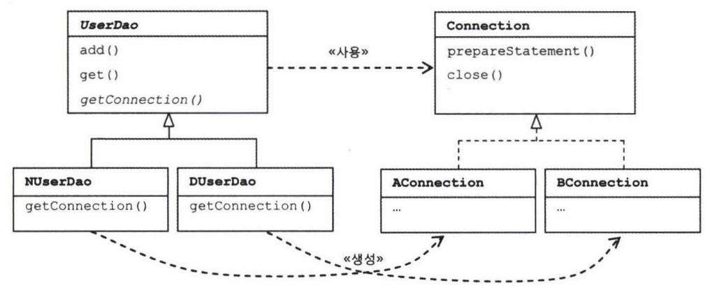

####DAO Data Access Object

DB를 사용해 데이터를 조회하거나 조작하는 기능을 전담하도록 만든 오브젝트


####자바빈 Java Bean = 간단히, 빈.

다음 두가지 관례에 따라 만들어진 오브젝트를 가리킨다.

- 디폴트 생성자 : 자바빈은 파라미터가 없는 디폴트 생성자를 갖고 있어야 한다.
> tool 이나 framework에서 reflection을 이용해 오브젝트를 생성하기 때문에 필요하다.

- 프로퍼티 : 자바빈이 노출하는 이름을 가진 속성을 프로퍼티라고 한다. 프로퍼티는 set으로 시작하는 수정자 메서드(setter)
          와 get으로 시작하는 접근자 메서드(getter)를 이용해 수정 또는 조회할 수 있다.


####리팩토링 Refactoring

기능이 추가되거나 바뀐 것은 없지만 깔끔하고(코드 내부의 설계가 개선되어 코드가 이해하기 편해진다.) 미래의 변화에 좀 더 손쉽게 대응할 수 있는 코드로 고치는 작업
겉으로 드러나는 기능은 그대로지만 코드 구조와 구현방법을 바꿈으로서 더 나은 코드를 만드는 작업
> 메서드 추출 extract method 기법
> : 공통의 기능을 담당하는 메서드로 중복된 코드를 뽑아내는 것

즉, 기존의 코드를 외부의 동작방식에는 변화 없이 내부 구조를 변경해서 재구성하는 작업 또는 기술을 말한다.
> 리팩토링이 절실히 필요한 코드의 특징을 **나쁜 냄새** 라고 부르기도 한다.
> 매우 흔히 발견되는 나쁜 냄새가 중복된 코드임.
> 나쁜냄새에는 어떤 종류가 있고, 그에 따른 적절한 리팩토링 방법은 무엇인지 알아보고, 충분한 연습을 해두면 좋음.
> '리팩토링' 마틴파울러,켄트 백 공저

####템플릿 메서드 패턴

상속을 통해 슈퍼클래스의 기능을 확장할 때 사용하는 가장 대표적인 방법
변하지 않는 기능은 슈퍼클래스에 만들어두고 자주 변경되며 확장할 기능은 서브클래스에 만들도록 한다.
**슈퍼클래스에서는 미리 추상 메서드 또는 오버라이드 가능한 메서드를 정의해두고 이를 활용해 코드의 기본 알고리즘을 담고있는 템플릿 메서드를 만든다.**

**슈퍼클래스에서 디폴트 기능을 정의해두거나 비워뒀다가 서브클래스에서 선택적으로 오버라이드 할 수 있도록
만들어둔 메서드를 Hook 메서드 라고 한다.**

서브클래스에서는 추상 메서드를 구현하거나, 훅 메서드를 오버라이드하는 방법을 이용해 기능의 일부를 확장한다.

****

```Java
public abstract class Super {
    public void templateMethod(){
        // 기본 알고리즘 코드

        // 기본 알고리즘 골격을 담은 메서드를 템플릿 메서드라 부른다.
        // 템플릿 메서드는 서브클래스에서 오버라이드하거나 구현할 메서드를 사용한다.
    }

    protected void hookMethod() {} // 선택적으로 오버라이드 가능한 훅 메서드
    public abstract void abstractMethod(); // 서브클래스에서 반드시 구현해야 하는 추상 메서드
}

public class Sub1 extends Super {
    // 슈퍼클래스의 메서드를 오버라이드하거나 구현해서 기능을 확장한다.
    // 다양한 확장클래스를 만들 수 있다.

    protected void hookMethod() {

    }

    public void abstractMethod() {

    }
}
```

####팩터리 메서드 패턴

서브클래스에서 구체적인 오브젝트 생성 방법을 결정하게 하는 것
서브클래스에서 오브젝트 생성 방법과 클래스를 결정할 수 있도록 미리 정의해둔 메서드를 팩토리 메서드라 함.

즉, 결과적으로 리턴되는 Connection 오브젝트가 동일한 종류의 Connection 구현 클래스의 오브젝트라 해도
오브젝트를 생성하는 방식이 다르다면, 팩토리 메서드 패턴으로 이해할 수 있다.



주의!
자바에서는 종종 오브젝트를 생성하는 기능을 가진 메서드를 일반적으로 팩터리 메서드라고 부르기도 한다.
이때 말하는 팩토리 메서드와 팩토리 메서드 패턴의 팩토리 메서드는 의미가 다르므로 혼동하지 않도록!

####객체지향 설계 원칙(SOLID, 5가지 객체지향 설계의 원칙)
객체지향의 특징을 잘 살릴 수 있는 설계의 특징을 말한다.
원칙이라는 건 어떤 상황에서든 100% 지켜져야 하는 절대적인 기준이라기 보다는,
예외는 있겠지만 대부분의 상황에 잘 들어맞는 가이드라인과 같은 것이다.

디자인 패턴은 특별한 상황에서 발생하는 문제에 대한 좀 더 구체적인 솔루션.
객체지향 설계원칙은 좀 더 일반적인 상황에서 적용 가능한 설계 기준.
디자인 패턴은 객체지향 설계 원칙을 잘 지켜서 만들어져 있다.

SRP ( The Single Responsibility Principle ) : 단일 책임 원칙
OCP ( The Open Closed Principle ) : 개방 폐쇄 원칙
LSP ( The Liskov Substitution Principle ) : 리스코프 치환 원칙
ISP ( The Interface Segregation Principle ) : 인터페이스 분리 원칙
DIP ( The Dependency Inversion Principle ) : 의존관계 역전 원칙

### 스프링 IoC의 용어 정리

####빈
빈, 빈 오브젝트 = 스프링이 IoC방식으로 관리하는 오브젝트 = 관리되는 오브젝트 managed object

주의 !
스프링을 사용하는 애플리케이션에서 만들어지는 모든 오브젝트가 다 빈은 아님!
그 중에서 스프링이 **직접** 그 생성과 제어를 담당하는 오브젝트 만을 빈이라고 부른다.

####빈 팩토리
스프링의 IoC를 담당하는 핵심 컨테이너.

빈을 등록하고, 생성하고, 조회하고 돌려주고, 그 외에 부가적인 빈을 관리하는 기능을 담당.
보통은 이 빈 팩토리를 바로 사용하지 않고 이를 확장한 애플리케이션 컨텍스트를 이용한다.
**빈 팩토리를 확장한 것이 애플리케이션 컨텍스트!**
BeanFactory라고 붙여쓰면 빈 팩토리가 구현하고 있는 가장 기본적인 인터페이스의 이름이 된다.
이 인터페이스에 getBean()과 같은 메서드가 정의되어 있다.

####애플리케이션 컨텍스트
빈 팩토리를 확장한 IoC컨테이너
빈을 등록하고 관리하는 기본적인 기능은 빈 팩토리와 동일하다.
스프링이 제공하는 각종 부가 서비스를 추가로 제공한다
**빈 팩토리라고 부를 때는 주로 빈의 생성과 제어의 관점에서 이야기하는 것**
**애플리케이션 컨텍스트라고 할 때는 스프링이 제공하는 애플리케이션 지원 기능을 모두 포함해서 이야기하는 것.**
스프링에서는 애플리케이션 컨텍스트라는 용어를 빈 팩토리보다 더 많이 사용한다.
ApplicationContext라고 적으면 애플리케이션 컨텍스트가 구현해야 하는 기본 인터페이스를 가리키는 것이기도 하다.
ApplicationContext는 BeanFactory를 상속한다.

####설정정보 / 설정 메타 정보
스프링의 설정정보란 애플리케이션 컨텍스트 또는 빈 팩토리가 IoC를 적용하기 위해 사용하는 메타정보를 말한다.
영어로 configuration이라고 하는데, 이는 구성정보 내지는 형상정보라는 의미다.

실제로 **스프링의 설정정보는** 컨테이너에 어떤 기능을 세팅하거나 조정하는 경우에도 사용하지만,
그보다는 **IoC컨테이너에 의해 관리되는 애플리케이션 오브젝트를 생성하고 구성할 때 사용** 된다.
애플리케이션의 형상정보라고 부르기도 한다.
또는 애플리케이션의 전체 그림이 그려진 청사진이라고도 함.

####컨테이너 또는 IoC컨테이너
애플리케이션 컨텍스트, 빈 팩토리 = 컨테이너 또는 IoC컨테이너
( IoC 방식으로 빈을 관리한다는 의미에서 )

IoC컨테이너는 좀 더 빈 팩토리 관점
컨테이너 또는 스프링 컨테이너는 애플리케이션 컨텍스트

스프링 = 스프링 컨테이너
' 스프링에 빈을 등록하고 ' : 스프링 = 스프링 커테이너 = 애플리케이션 컨텍스트

애플리케이션 컨텍스트는 그 자체로 ApplicationContext 인터페이스를 구현한 오브젝트를 가리키기도 함.
애플리케이션 컨텍스트 오브젝트는 하나의 애플리케이션에서 보통 여러 개가 만들어져 사용된다. (???)
이를 통틀어서 스프링 컨테이너라고 부를 수 있다.

####스프링 프레임워크
IoC컨테이너, 애플리케이션 컨텍스트를 포함해서 스프링이 제공하는 모든 기능을 통틀어 말할 때 주로 사용함.
그냥 줄여서 스프링.


####오브젝트의 동일성과 동등성
자바에서 **두 개의 오브젝트가 같은가**

완전히 같은 동일한(identical) 오브젝트가
동일한 정보를 담고있는(equivalent)오브젝트
라고 말하는 건 분명한 차이가 있음.

**동일한 오브젝트 identical object**
두 개의 오브젝트가 동일하다면 사실은 하나의 오브젝트만 존재하는 것이고 두 개의 오브젝트 레퍼런스 변수를 갖고 있을 뿐이다.
> == 연산자로 비교. identity 비교.

**동일한 정보를 담고 있는 오브젝트 equivalent object**
동등한 경우에는 두 개의 각기 다른 오브젝트가 메모리상에 존재하는 것인데, 오브젝트의 동등성의 기준에 따라 두 오브젝트의 정보가 동등하다고 판단하는 것일 뿐임.
> equals() 메서드로 비교. equality 비교.

동일한 오브젝트는 동등하기도 할 것이다. 하지만 동등하다고 해서 동일한 것은 아니다.

자바 클래스를 만들 때 equals()메서드를 따로 구현하지 않았다면,
최상위 클래스인 Object 클래스에 구현되어 있는 equals() 메서드가 사용된다.
**Object의 equals() 메서드는 두 오브젝트의 동일성을 비교** 해서 그 결과를 돌려준다.

#### 싱글톤 패턴 Singleton Pattern
디자인 패턴 중에서 가장 자주 활용되는 패턴이면서 가장 많은 비판을 받는 패턴임.
GoF멤버조차도 싱글톤 패턴은 매우 조심해서 사용해야 하거나 피해야 할 패턴이라고 할정도.

어떤 클래스를 애플리케이션 내에서 제한된 인스턴스 개수, 이름처럼 주로 하나만 존재하도록 강제하는 패턴.
이렇게 하나만 만들어지는 클래스의 오브젝트는 애플리케이션 내에서 전역적으로 접근이 가능하다.
단일 오브젝트만 존재해야 하고, 이를 애플리케이션의 여러 곳에서 공유하는 경우에 주로 사용함.

#### 의존관계 주입, 의존성 주입, 의존 오브젝트 주입?
의존성 주입 : 흔히 사용되는 용어지만 의존성이라는 말이 DI의 의미를 잘 드러내주진 못함.

의존(종속) 오브젝트 주입 : Di가 일어나는 방법에 초점
( 엄밀히 말해 오브젝트는 다른 오브젝트에 주입할 수 있는게 아님. 오브젝트의 레퍼런스가 전달될 뿐임.)
이러한 동작방식(매커니즘)보다느 의도를 가지고 이름을 짓는게 좋으므로

**의존관계 주입이 더 적절. 혹은 의존관계 설정.**
(DI는 오브젝트 레퍼런스를 외부로부터 제공,주입받고 이르 통해 여타 오브젝트와 다이나믹하게 의존관계가 만들어지는 것)

#### DI받는다
DI의 동작방식은 외부로부터의 주입.
주의!
단지 외부에서 파라미터로 오브젝트를 넘겨줬다고 해서(주입해줬다고 해서), 다 DI는 아님!

주입받는 메서드 파라미터가 이미 특정 클래스 타입으로 고정되어 있다면 DI가 일어날 수 없다.
DI에서 말하는 주입은 다이나믹하게 구현 클래스를 결정해서 제공받을 수 있도록 인터페이스 타입의 파라미터를 통해 이뤄져야 한다.

DI받는다 = DI원리를 지키며 외부에서 오브젝트를 제공받는 방법
(단순한 오브젝트 주입이 아니라 DI개념을 따르는 주입임을 강조!)

#### DTD와 스키마
XML 문서는 미리 정해진 구조를 따라서 작성됐는지 검사할 수 있다.
XML 문서의 구조를 정의하는 방법에는 DTD와 스키마(schema)가 있다.

스프링의 XML설정 파일은 이 두가지 방식을 모두 지원한다.

DTD를 사용할 경우에는 <beans> 엘리먼트 앞에 다음과 같은 DTD 선언을 넣어준다.
```
<!DOCTYPE beans PUBLIC "-//SPRING//DTD BEAN 2.0//EN"
"http://www.springframework.org/dtd/spring-beans-2.0.dtd">
```
스프링은 DI를 위한 기본 태그인 <beans>, <bean> 외에도 특별한 목적을 위해 별도의 태그를 사용할 수 있는 방법을 제공함.
이 태그들은 각각 별개의 스키마 파일에 정의되어 있고 독립적인 네임스페이스를 사용해야만 한다.
따라서 이런 태그를 사용하려면 DTD대신 네임스페이스가 지원되는 스키마를 사용해야 한다.
<beans>태그를 기본 네임 스페이스로 하는 스키마 선언은 다음과 같다.
```
<beans xmlns="http://www.springframework.org/schema/beans"
  xmlns:xsi="http://www.w3.org/2001/XMLSchema-instance"
  xsi:schemaLocation="http://www.springframework.org/schema/beans
  http://www.springframework.org/schema/beans/spring-beans-3.0.xsd">
```

특별한 이유가 없다면 **DTD보다 스키마를 사용하는 편이 바람직** 함.
선언이 좀 더 길어서 입력하기 힘들게 보일지 모르겠지만 스프링 IDE의 XML 에디터를 사용하면
스키마 선언을 간단히 만들고 관리할 수 있다.
