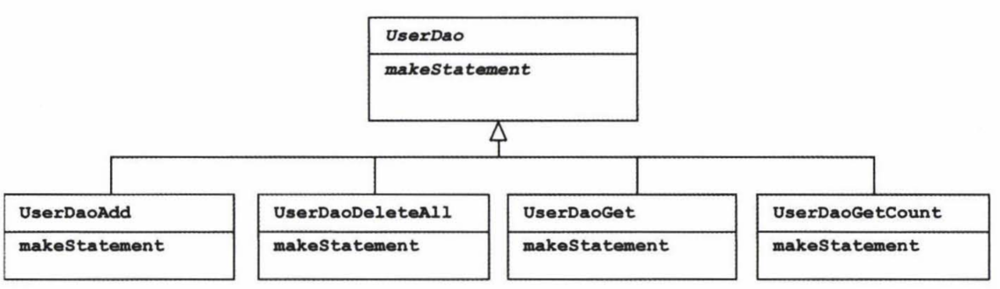
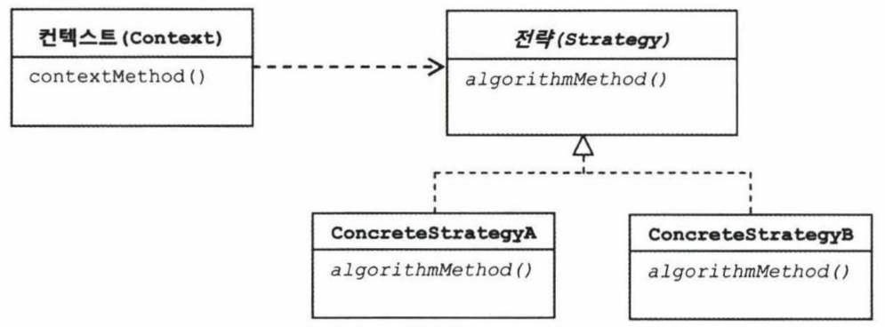
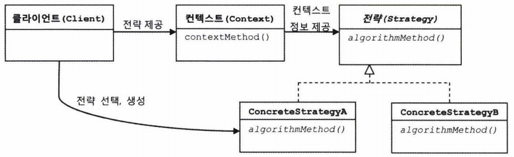

### JDBC try/catch/finally 코드의 문제점

복붙하다가 실수하면 ?
당장에 컴파일 에러가 나지는 않음.
그러나 해당 메서드가 호출되고 나면 커넥션이 하나씩 반환되지 않고 쌓여가게된다. 서버에 배치해서 사용하면 언젠가 DB풀에 설정해놓은 최대 DB커넥션 개수를 넘어설 것이고, 서버에서 리소스가 꽉 찼다는 에러가 나면서 서비스가 중단되는 상황이 발생한다.

이런 코드를 효과적으로 다루는 방법 ?
변하지 않지만 많은 곳에서 중복되고 있는 코드
로직에 딸 자꾸 확장되고 자주 변하는 코드
각각을 잘 분리한다.
> 그렇지만 DAO와 DB연결 기능을 분리하는 것이 아니라서 1장에서 분리했던 해결방법과는 조금 다르다.

### 분리와 재사용을 위한 디자인 패턴 적용
### 메서드 추출
1
변하는 부분을 메서드로 빼낸다.
> 보통은 변하지 않는 부분을 빼내지만 여기서는 변하는 부분을 변하지 않는 부분이 감싸고 있는 형태라서 반대로 했음.

### 템플릿 메서드 패턴의 적용
템플릿 메서드 패턴 : 상속을 통해 기능을 확장해서 사용하는 부분
> 변하지 않는 부분은 슈퍼클래스에 두고 변하는 부분은 추상 메서드로 정의해둬서 서브클래스에서 오버라이드하여 새롭게 정의해 쓰도록 하는 것이다.

추출해서 별도의 메서드로 독립시킨 makeStatement() 메서드를 추상 메서드 선언으로 변경한다.
```java
abstract protected PreparedStatement makeStatement(Connection c) throws SQLException;
```
물론 UserDao클래스도 추상 클래스가 되어야함!
그리고 이를 상속하는 서브클래슬르 만들어서 거기서 이 메서드(preparedStatement)를 구현한다.
```java
public class UserDaoDeleteAll extends UserDao{

}
```

이제 UserDao 클래스의 기능을 확장하고 싶을 때마다 상속을 통해 자유롭게 확장이 가능하다. 그렇다고 확장때문에 기존의 상위 DAO클래스에 불필요한 변화는 생기지 않는다.
=> 객체지향 설계의 핵심 원리인 개방폐쇄원칙OCP

하지만 템플릿 메서드 패턴으로의 접근은 제한이 많다.
1
특히, DAO로직마다 상속을 통해 새로운 클래스를 만들어야한다는 점이 가장 큰 문제다.
> 만약 UserDao의 JDBC메서드가 4개일 경우 4개의 서브클래스를 만들어서 사용해야 한다.



2
확장구조가 이미 클래스를 설계하는 시점에서 고정되어 버린다는 점.
> 변하지 않는 코드 부분( JDBC try/catch/finally 블록 부분)과
> 변하는 코드 부분(PreparedStatement담고있는 서브 클래스들)이
> 이미 클래스 레벨에서 컴파일 시점에 그 관계가 결정되어 있다.

관계에 대한 유연성이 떨어져 버림.. => 상속을 통한 확장의 단점(즉, 템플릿 메서드 패턴의 단점)

### 전략 패턴의 적용
개방폐쇄원칙OCP을 잘 지키는 구조이면서도 템플릿 메서드 패턴보다 유연하고 확장성이 뛰어난 것이, 오브젝트를 아예 둘로 분리하고 클래스 레벨에서는 인터페이스를 통해서만 의존하도록 만드는 **전략패턴** 이다.

전략패턴은 OCP관점에서 보면 확장에 해당하는 변하는 부분을 별도의 클래스로 만들어 추상화된 인터페이스를 통해 위임하는 방식이다.

왼쪽의 Context의 contextMethod()에서 **일정한 구조를 가지고 동작** (변하지 않는 부분에 해당. 변하지 않는 맥락context)하다가 특정 확장 기능은 Strategy 인터페이스를 통해 외부의 독립된 전략 클래스(여기에 구현된 메서드가 전략패턴에서 말하는 전략)에 위임한다.


PreparedStatement를 생성하는 전략을 호출할 때는 컨텍스트 내에서 만들어둔 DB커넥션을 전달해야한다. 커넥션이 없으면 PreparedStatement도 만들수 없으니..
```Java
Connection c = dataSource.getConnection();
PreparedStatement ps = c.prepareStatement("delete from users");
```

####전략패턴으로 구현해보자

전략의 인터페이스
```Java
public interface StatementStrategy {
    PreparedStatement makePreparedStatment(Connection c) throws SQLException;
}
```

전략클래스
```java
public class DeleteAllStatement implements StatementStrategy{
    public PreparedStatement makePreparedStatment(Connection c) throws SQLException {
        PreparedStatement ps = c.prepareStatement("delete from users");
        return ps;
    }
}
```

컨텍스트
```java
public void deleteAll() throws SQLException {
    try{
        c = dataSource.getConnection();

        StatementStrategy strategy = new DeleteAllStatement();
        ps = strategy.makePreparedStatment(c);

        ps.executeUpdate();
    }catch(SQLException e){

    }
}
```

전략패턴은 필요에 딸 컨텍스트는 그대로 유지(OCP 폐쇄 원칙)되면서 전략을 바꿔쓸 수 있다(OCP 개방 원칙)는 것인데
위 코드에 보면 컨텍스트 안에서 이미 구체적인 전략 클래스인 DeleteAllStatement를 사용하도록 고정되어 있다..
>컨텍스트가 StatementStrategy 인터페이스뿐 아니라 특정 구현 클래스인 DeleteAllStatement까지 직접 알고있다!!
> 전략패턴도 OCP에 잘 들어맞는다고 할 수 없다는 뜻!!

### DI 적용을 위한 클라이언트/컨텍스트 분리
전략패턴을 좀 더 실제적으로 사용하는 방법을 알아보자.

전략패턴에 따르면
Context가 어떤 전략을 사용하게 할 것인가는 Context를 사용하는 앞단의 Client가 결정하는게 일반적이다.
> 즉, Client가 구체적인 전략의 하나를 선택하고 오브젝트로 만들어서 Context에 전달한다.

Context는 전달받은 그 Strategy구현 클래스의 오브젝트를 사용한다.


이 구조에서 전략 오브젝트 생성과 컨텍스트로의 전달을 담당하는 책임을 분리시킨 것이 ObjectFactory이며, 이를 일반화한 것이 앞에서 살펴봤던 의존관계 주입DI이었다.
결국 DI란 이러한 전략 패턴의 장점을 일반적으로 활용할 수 있도록 만든 구조!

```Java
public class Hello{
    public void jdbcContextWithStatementStrategy(StatementStrategy stmt) throws SQLException {


        try {

            c = dataSource.getConnection();
            ps = stmt.makePreparedStatment(c);

        } catch (SQLException e) {
            throw e;
        } finally {

        }
    }

    // 클라이언트 책임 담당
    public void deleteAll() throws SQLException {
        StatementStrategy st = new DeleteAllStatement(); // 전략 클래스 선정해서 오브젝트 생성
        jdbcContextWithStatementStrategy(st); // 컨텍스트 호출, 전략 오브젝트 전달
    }
}
```
클라이언트와 컨텍스트는 클래스를 분리하진 않았지만, 의존관계와 책임으로 볼 때 이상적인 클라이언트/컨텍스트관계를 갖고 있다.
특히 클라이언트가 컨텍스트가 사용할 전략을 정해서 전달한다는 면에서 DI구조
