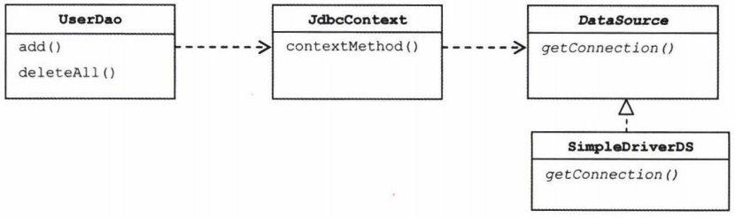
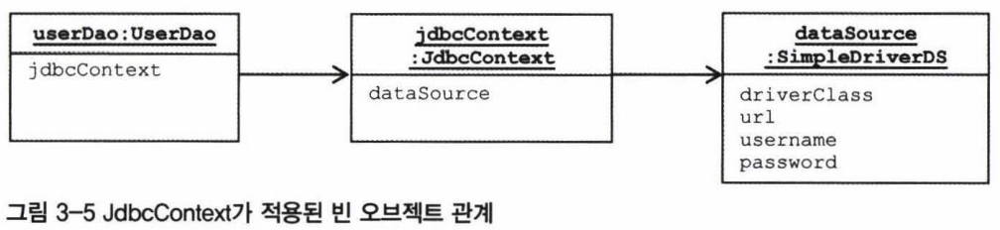
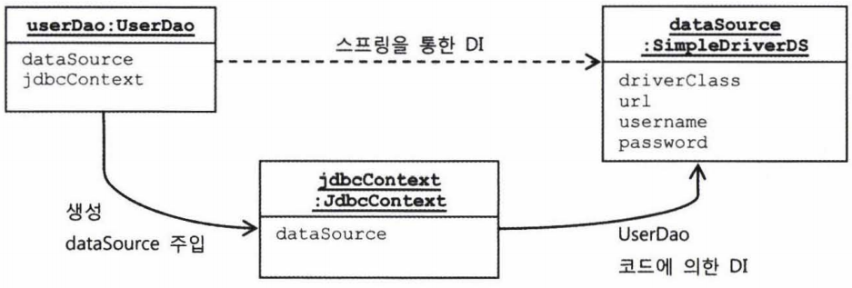

### JdbcContext의 분리
전략패턴의 구조로 보면
UserDao의 메서드 => 클라이언트
익명 내부 클래스로 만들어지는 것 => 개별적인 전략
jdbcContextWithStatementStrategy() => 컨텍스트

컨텍스트 메서드는 UserDao내의 PreparedStatement를 실행하는 기능을 가진 메서드에서 공유할 수 있다.

뿐만 아니라 다른 DAO에서도 사용 가능하다. => UserDao클래스 밖으로 독립시켜 모든 DAO가 사용할 수 있게 해보자.

### 클래스 분리
분리해서 만들 클래스 이름 JdbcContext

DataSource가 필요한 것은 UserDao가 아니라 JdbcContext가 된다.
> DB커넥션을 필요로 하는 코드는 JdbcContext안에 있으므로

JdbcContext가 DataSource에 의존하고 있으므로 DataSource 타입 빈을 DI 받을 수 있게 해줘야한다.

### 빈 의존관계 변경
UserDao는 이제 JdbcContext에 의존하게 되었다.

그런데 JdbcContext는 인터페이스가 아니라 구체 클래스다.
스프링의 DI는 기본적으로 인터페이스를 사이에 두고 의존 클래스를 바꿔서 사용하도록 하는게 목적이다.

하지만 이 경우 JdbcContext는 그 자체로 독립적인 JDBC 컨텍스트를 제공하는 서비스 오브젝트로서 의미가 있을 뿐 방법이 바뀔 가능성이 없다. 따라서 인터페이스를 구현하도록 만들지 않았다. 따라서 UserDao와 JdbcContext는 인터페이스를 사이에 두지 않고 DI를 적용하는 특별한 구조가 되었다.


스프링의 빈 설정은 클래스 레벨이 아니라 런타임시에 만들어지는 오브젝트 레벨의 의존관계에 따라 정의된다.


### JdbcContext의 특별한 DI
인터페이스를 사용한 DI의 경우 클래스레벨에서 구체적인 의존관계가 만들어지지 않는다.
따라서 코드에서 직접 클래스를 사용하지 않아도 됐고, 덕분에 설정을 변경하는 것만으로도
얼마든지 다양한 의존 오브젝트를 변경해서 사용할 수 있다.

```Java
public class UserDao {
    private JdbcContext jdbcContext;

    public void setJdbcContext(JdbcContext jdbcContext){
        this.jdbcContext = jdbcContext;
    }

    public void add(final User user) throws SQLException {
        this.jdbcContext.workWithStatementStrategy( new StatementStrategy(){ ... });
    }
}
```
UserDao는 인터페이스를 거치지 않고 코드에서 바로 JdbcContext클래스를 사용하고 있다.
런타임시에 DI방식으로 외부에서 오브젝트를 주입해주는 방식을 사용하긴 하지만, 인터페이스를 거치지 않고 바로 사용하므로 의존 오브젝트의 구현 클래스를 변경할 수 없는 상황이다.

#### 스프링 빈으로 DI
그렇다고 꼭 인터페이스로 뽑아내야한다? 는 아님.
인터페이스를 뽑아내서 정의해두고 사용하는 것은 스프링 DI의 기본의도이긴 하지만
꼭 그럴 필요는 없다.

의존관계 주입DI이라는 개념을 **충실히** 따르자면, 인터페이스를 사이에 둬서 클래스레벨에서는 의존관계가 고정되지 않게 하고, 런타임 시에 의존할 오브젝트와의 관계를 다이나믹하게 주입해주는 것이 맞다.
인터페이스를 사용하지 않았다면 엄밀히 말해 온전한 DI라고 볼수는 없다.

그러나 스프링의 DI는 **넓게 보자면** 객체의 생성과 관계설정에 대한 제어권한을 오브젝트에서 제거하고 외부로 위임했다는 IoC라는 개념을 포괄한다.

인터페이스를 사용해서 클래스를 자유롭게 변경할 수 있게 하지는 않았지만, JdbcContext를 스프링을 이용해 UserDao객체에서 사용하게 주입했다는 건 DI의 기본을 따르고 있다고 볼 수 있다.

(JdbcContext를 UserDao와) DI구조로 만들어야 할 이유
1
JdbcContext가 스프링 컨테이너의 싱글톤 레지스트리에서 관리되는 싱글톤 빈이 되기 때문
**JdbcContext는 그 자체로 변경되는 상태정보를 갖고 있지 않다.**
내부에서 사용할 dataSource라는 인스턴스 변수는 있지만, dataSource는 읽기 전용이므로 JdbcContext가 싱글톤이 되는데 아무런 문제가 없다.
JdbcContext는 JDBC컨텍스트 메서드를 제공해주는 일종의 서비스 오브젝트로서 의미가 있고, 그래서 싱글톤으로 등록돼서 여러 오브젝트에서 공유해 사용되는 것이 이상적이다.

**2**(중요)
JdbcContext가 DI를 통해 다른 빈에 의존하고 있기 때문.
JdbcContext는 dataSource프로퍼티를 통해 DataSource 오브젝트를 주입받도록 되어 있다. DI를 위해서는 주입되는 오브젝트와 주입받는 오브젝트 양쪽 모두 스프링 빈으로 등록돼야 한다. 스프링이 생성하고 관리받는 IoC대상이어야 DI에 참여할 수 있기 때문이다.
따라서 JdbcContext는 다른 빈을 DI받기 위해서 스프링 빈으로 등록돼야 한다.
> 실제로 (스프링에는 드물지만) 이렇게 인터페이스를 사용하지 않는 클래스를 직접 의존하는 DI가 등장하는 경우도 있다.

####중요한건 인터페이스 사용 여부다.
왜 인터페이스를 사용하지 않았을까?

인터페이스가 없다는 건 JdbcContext와 UserDao가 매우 긴밀한 관계를 가지고 강하게 결합되어 있다는 의미다. 비록 클래스는 구분되어 있지만 UserDao와 JdbcContext는 강한 응집도를 갖고 있다. 항상 함께 사용돼야 한다.
UserDao가 JDBC방식 대신 JPA나 하이버네이트 같은 ORM을 사용해야 한다면 JdbcContext도 통째로 바뀌어야 한다. JdbcContext는 DataSource와 달리 테스트에서도 다른 구현으로 대체해서 사용할 이유가 없다. 이런 경우는 굳이 인터페이스를 두지 말고 강력한 결합을 가진 관계를 허용하면서 **싱글톤으로 만드는 것** 과 JdbcContext에 대한 **DI필요성을 위해 스프링의 빈으로 등록** 해서 UserDao에 DI되도록 만들어도 좋다.

단, 이렇게 클래스를 바로 사용하는 코드 구성을 DI에 적용하겠다는 방법은 위에서 말한 것과 같이 특별한 이유가 있는 것이 아니고서는 가장 마지막으로 고려되는 방법이라는 것을 잊지말자.
> 그저 인터페이스를 만들기 귀찮으니까 그냥 클래스 사용하자 (X)

반대로 위의 상황에서도 **굳이** 원한다면 JdbcContext에 인터페이스를 두고 UserDao에서 인터페이스를 사용하도록 만들어도 문제되진 않는다.

#### 코드를 이용하는 수동 DI
스프링을 이용해 빈으로 등록하는 것 대신 UserDao **내부에서 직접 DI를 적용하는 방법**

문제 1
싱글톤으로 만들려는 것은 포기해야한다.
> JdbcContext를 스프링의 빈으로 등록해서 사용했던 첫 번째 이유

그러나 포기했다고 해서 DAO메서드가 호출될 때마다 JdbcContext오브젝트를 새로 만들어야 한다는 건 아님.

- 다른 방법이 있다. ( 타협안.. )
  DAO 메서드마다는 아니지만 **DAO클래스 마다** 하나의 JdbcContext 오브젝트를 갖게 한다.
  >많아봐야 DAO개수 정도?(수백개)
  JdbcContext에는 내부에 두는 상태 정보가 없다. 따라서 오브젝트 수십, 수백 개가 만들어진다고 해도 메모리에 주는 부담은 거의 없음. 또한 자주 만들어졌다가 제거되는 게 아니기 때문에 GC에 대한 부담도 없다.

JdbcContext를 스프링 빈으로 등록하지 않았으므로
**다른 누군가가 JdbcContext의 생성과 초기화를 책임** 져야 한다.
JdbcContext의 제어권은 UserDao가 갖는 것이 적당하다.
(**자신이 사용할** 오브젝트를 직접 만들고 초기화하는 전통적인 방법에 의하면..)

문제 2
UserDao에서 JdbcContext를 직접 생성해서 사용하는 경우에 (여전히 JdbcContext는 DataSource 타입 빈을 dynamic하게 주입받아서 사용해야한다. 안그러면 DataSource 구현 클래스를 자유롭게 바꿔가면서 적용할 수 없기 때문이다.) JdbcContext 자신은 스프링의 빈이 아니니 DI컨테이너를 통해 DI받을 수도 없다. 어떻게 해야할까?

JdbcContext는 다른 빈을 인터페이스를 통해 간접적으로 의존하고 있다.
> 다른빈을 의존하고 있다면,
> 의존 오브젝트를 DI를 통해 제공받기 위해서라도 자신도 빈으로 등록돼야 한다고 했다.
> JdbcContext를 스프링의 빈으로 등록해서 사용했던 두 번째 이유

- 방법이 한가지 있다.
  JdbcContext에 대한 제어권을 갖고 생성과 관리를 담당하는 UserDao에게 DI까지 맡기기
  > DI의 동작원리 : 오브젝트를 생성하고 그 의존 오브젝트를 수정자 메서드로 주입해주는 것
  > UserDao가 임시로 DI컨테이너처럼 동작하게 만드련 됨.

  JdbcContext에 주입해줄 의존 오브젝트인 DataSource는 UserDao가 대신 DI받도록 한다.
  > UserDao는 직접 DataSource빈을 필요로 하지 않지만 JdbcContext에 대한 DI작업에 사용할 용도로 제공받는 것뿐. UserDao는 주입받은 DataSource 빈을 JdbcContext를 만들고 초기화하는 과정에만 사용하고 버리면 된다.

  
  스프링의 설정파일에는 두 개의 빈만 정의됨. userDao와 dataSource.

이 방법의 장점
굳이 인터페이스를 두지 않아도 될 만큼 긴밀한 관계를 갖는 DAO클래스와 JdbcContext를 어색하게 따로 빈으로 분리하지 않고 내부에서 직접 만들어 사용하면서도 다른 오브젝트에 대한 DI를 적용할 수 있다는 점.
> 이렇게 한 오브젝트의 수정자 메서드에서 다른 오브젝트를 초기화하고 코드를 이용해 DI하는 것은 스프링에서도 종종 사용되는 기법임.

####[정리]
####JdbcContext와 같이 인터페이스를 사용하지 않고 DAO와 밀접한 관계를 갖는 클래스를 DI에 적용하는 방법 두 가지: 스프링 빈으로 DI / 코드를 이용하는 수동 DI

**1  스프링 빈으로 DI**
(인터페이스를 사용하지 않는 클래스와의 의존관계이지만)
스프링의 DI를 이용하기 위해 빈으로 등록해서 사용하는 방법

장점:
=> 오브젝트 사이의 실제 의존관계가 설정파일에 명확하게 드러난다.
  ( 하지만 DI의 근본적인 원칙(인터페이스를 사용)에 부합하지 않는 구체적인 클래스와의 관계가 설정에 직접 노출된다는 단점 )

**2 코드를 이용하는 수동 DI**
DAO의 코드를 이용해 수동으로 DI하기

장점:
=> JdbcContext가 UserDao 내부에서 만들어지고 사용되면서 그 관계를 외부로 드러내지 않는다. 필요에 따라 내부에서 은밀히 DI를 수행하고 그 전략을 외부에는 감출 수 있다.
단점:
=> JdbcContext를 여러 오브젝트가 사용하더라도 싱글톤으로 만들 수 없고, DI작업을 위한 부가적인 코드가 필요하다.

상황에 따라 적절하다고 판단되는 방법을 선택할 것. 어떤 방법이 더 낫다고 말할 수 없음.
다만 왜 그렇게 선택했는지에 대한 분명한 이유와 근거가 있어야 한다.
> 분명하게 설명할 자신이 없다면 그냥 인터페이스를 만들어서 평범한 DI구조로 만드세요
