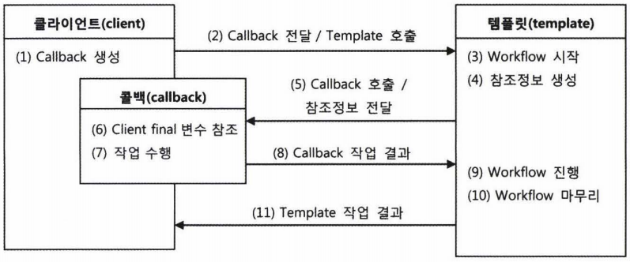
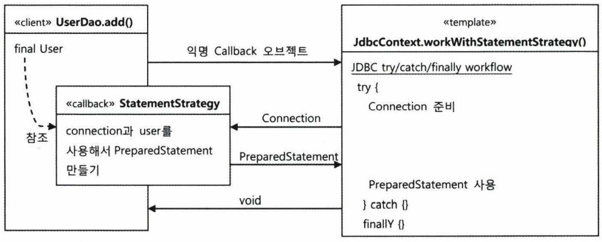
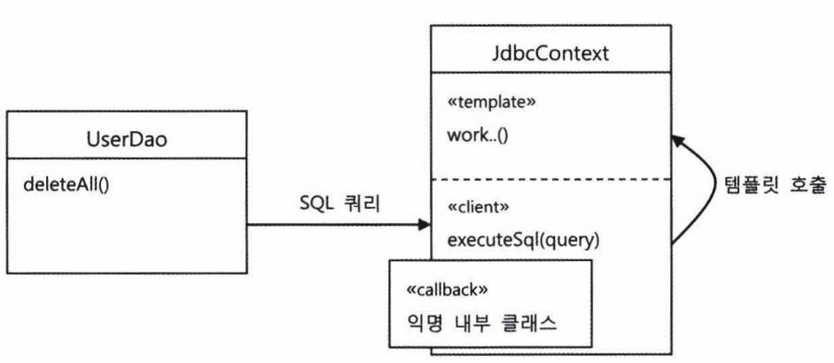

스프링에서의 **템플릿/콜백 패턴**
전략패턴의 기본 구조에 익명 내부 클래스를 활용한 방식

* 전략패턴의 기본 구조
  복잡하지만 바뀌지 않는 일정한 패턴을 갖는 작업 흐름이 존재하고 그중 일부분만 자주 바꿔서 사용해야 하는 경우에 적합한 구조.
  > 지금까지의 UserDao와 StatementStrategy, JdbcContext를 이용해 만든 코드는
  일종의 전략패턴이 적용된 것.

전략 패턴의 context를 **템플릿**
익명 내부 클래스로 만들어지는 오브젝트를 **콜백**


###템플릿 / 콜백의 동작원리
템플릿은 고정된 작업 흐름을 가진 코드를 재사용한다는 의미에서 붙인 이름
콜백은 템플릿 안에서 호출되는 것을 목적으로 만들어진 오브젝트를 말한다.

#### 템플릿/콜백의 특징
여러 개의 메서드를 가진 일반적인 인터페이스를 사용할 수 있는 전략패턴의 전략과 달리
템플릿/콜백 패턴의 콜백은 보통 단일 메서드 인터페이스를 사용한다.
템플릿의 작업 흐름 중 특정 기능을 위해 한 번 호출되는 경우가 일반적이기 때문이다.
> 하나의 템플릿에서 여러 가지 종류의 전략을 사용해야한다면 하나 이상의 콜백 오브젝트를 사용할 수도 있다.

콜백은 일반적으로 하나의 메서드를 가진 인터페이스를 구현한 익명 내부 클래스로 만들어진다고 보면된다.

콜백 인터페이스의 메서드에는 보통 파라미터가 있다. 이 파라미터는 템플릿의 작업 흐름 중에 만들어지는 컨텍스트 정보를 전달받을 때 사용된다.
> JdbcContext에서는 템플릿인 workWithStatementStrategy() 메서드 내에서 생성한 Connection 오브젝트를 콜백의 메서드인 makePreparedStatement()를 실행할 때 파라미터로 넘겨준다. PreparedStatement를 만들기 위해서는 JDBC컨텍스트/템플릿 안에서 만들어진 DB 커넥션이 필요하기 때문이다.

#### 템플릿/콜백의 작업 흐름

- 클라이언트의 역할
  : 템플릿 안에서 실행될 로직을 담은 콜백 오브젝트를 만들고, 콜백이 참조할 정보를 제공.
    만들어진 콜백은 클라이언트가 템플릿의 메서드를 호출할 때 파라미터로 전달된다.
- 템플릿은 정해진 작업 흐름을 따라 작업을 진행하다가 내부에서 생성한 참조정보를 가지고 콜백 오브젝트의 메서드를 호출한다.
  콜백은 클라이언트 메서드에 있는 정보와 템플릿이 제공한 참조정보를 이용해서 작업을 수행하고 그 결과를 다시 템플릿에 돌려준다.
- 템플릿은 콜백이 돌려준 정보를 사용해서 작업을 마저 수행한다. 경우에 따라 최종 결과를 클라이언트에게 다시 돌려주기도 한다.

> DI방식의 전략패턴 구조라고 생각하고 보면 간단하다.

클라이언트가 템플릿 메서드를 호출하면서 콜백 오브젝트를 전달하는 것
=> 메서드 레벨에서 일어나는 DI
템플릿이 사용할 콜백 인터페이스를 구현한 오브젝트를 메서드를 통해 주입해주는 DI작업이 클라이언트가 템플릿의 기능을 호출하는 것과 동시에 일어난다.

> 일반적인 DI라면 템플릿에 인스턴스 변수를 만들어두고 사용할 의존 오브젝트를 수정자 메서드로 받아서 사용할 것이다.

템플릿/콜백 방식의 특징
- 매번 메서드 단위로 사용할 오브젝트를 새롭게 전달받는다
- 콜백 오브젝트가 내부 클래스로서 자신을 생성한 클라이언트 메서드 내의 정보를 **직접** 참조한다
  > 클라이언트와 콜백이 강하게 결합된다는 점이 일반적인 DI와 조금 다르다.

템플릿/콜백 방식은 전략패턴과 DI의 장점을 익명 내부 클래스 사용 전략과 결합한 독특한 활용법
> 단순히 전략 패턴으로만 보기엔 독특한 특징이 많으므로 템플릿/콜백을 하나의 고유한 디자인 패턴으로 기억해두자.

다만 이 패턴에 녹아있는 전략 패턴과 수동 DI를 이해할 수 있어야한다.

###JdbcContext에 적용된 템플릿/콜백
> 템플릿과 클라이언트가 메서드 단위인 것이 특징!
> 각 오브젝트 사이에서 만들어지고 전달되는 정보와 오브젝트들의 역할을 생각해보자.



JdbcContext의 workWithStatementStrategy() 템플릿은 리턴 값이 없는 단순한 구조
조회 작업에서는 보통 템플릿의 작업 결과를 클라이언트에 리턴해줌.
템플릿의 작업흐름이 좀 더 복잡한 경우에는 한 번 이상 콜백을 호출하기도 하고 여러 개의 콜백을
클라이언트로부터 받아서 사용하기도 한다.

### 편리한 콜백의 재활용
템플릿/콜백 방식의 한 가지 아쉬운 점
- DAO메서드에서 매번 익명 내부 클래스를 사용하기 때문에 상대적으로 코드를 작성하고 읽기가 불편하다.
> 중첩된 괄호 등등

#### 콜백의 분리와 재활용
복잡한 익명 내부 클래스의 사용을 최소화해보자.

분리를 통해 재사용이 가능한 코드를 찾아낼 수 있다면 익명 내부 클래스를 사용한 코드를 간결하게 만들 수 있다.
```java
public void deleteAll() throws SQLException {
    this.jdbcContext.workWithStatementStrategy(
        new StatementStrategy() {
            public PreparedStatement makePreparedStatement(Connection c)
                throws SQLException {
                  return c.prepareStatement("delete from users");
            }
        }
    )
}
```
위 코드에서 바뀌는 부분은 오직 "delete from users"라는 문자열뿐이다.
그렇다면 SQL문장만 파라미터로 받아서 바꿀수 있게 하고 메서드 내용 전체를 분리해 별도의 메서드로 만들어보자.

---
```UserDao 클래스```
```java
// UserDao의 메서드
public void deleteAll() throws SQLException {
    executeSql("delete from users");
}
```

```java
// 재활용 가능한 콜백을 담은 메서드
public void executeSql(final String query) throws SQLException {
    this.jdbcContext.workWithStatementStrategy(
        // 변하지 않는 콜백 클래스 정의 및 오브젝트 생성
        new StatementStrategy() {
            public PreparedStatement makePreparedStatement(Connection c)
                throws SQLException {
                  return c.prepareStatement(query);
            }
        }
    );
}
// SQL을 담은 파라미터를 final로 선언해서 익명 내부 클래스인 콜백 안에서 직접 사용할 수 있게 해준다!!
```
----
변하는 것과 변하지 않는 것을 분리하고 변하지 않는 것은 유연하게 재활용할 수 있게 만든다는 간단한 원리를 계속 적용하면 단순하면서도 안전하게 작성 가능한 코드가 완성된다.

#### 콜백과 템플릿의 결합
앞서 분리한 executeSql() 메서드를 모든 DAO가 공유할 수 있는 템플릿 클래스 안으로 옮겨서 UserDao 외의 다른 dao에서도 사용할 수 있도록 해보자.

---

```JdbcContext 클래스```
```java
public class JdbcContext{
    ...
    public void executeSql(final String query) throws SQLException {
        workWithStatementStrategy(
            new StatementStrategy() {
                public PreparedStatement makePreparedStatement(Connection c)
                    throws SQLException {
                      return c.prepareStatement(query);
                }
            }
        );
    }
}
```

```UserDao클래스```
```java
public void deleteAll() throws SQLException {
    this.jdbcContext.executeSql("delete from users");
}
```
---
이제 모든 DAO메서드에서 executeSql() 메서드를 사용할 수 있다.

위의 경우는 하나의 목적을 위해 서로 긴밀하게 연관되어 동작하는 응집력이 강한 코드들이기 때문에 한 군데 모여있는게 유리하다.
> 일반적으로는 성격이 다른 코드들은 가능한 한 분리하는 편이 낫다

즉, 구체적인 구현과 내부의 전략 패턴, 코드에 의한 DI, 익명 내부 클래스 등의 기술은 최대한 감쳐두고, 외부(왼쪽 UserDao같은)에는 꼭 필요한 기능을 제공하는 단순한 메서드만 노출해주는 것이다.

### 템플릿/콜백의 응용
템플릿/콜백 패턴은 스프링에서만 사용할 수 있다거나 스프링만 제공해주는 독점적인 기술이 아님!
다만 스프링만큼 이 패턴을 적극적으로 활용하는 프레임워크는 없다.
> 실제로 스프링의 많은 API나 기능을 살펴보면 템플릿/콜백 패턴을 적용한 경우를 많이 발견할 수 있다.
> DI도 따지고 보면 순수한 스프리의 기술은 아님.
> 스프링은 단지 이를 편리하게 사용할 수 있도록 도와주는 컨테이너를 제공하고, 이런 패턴의 사용방법을 지지해주는 것 뿐이다.

스프링에는 다양한 자바 엔터프라이즈 기술에서 사용할 수 있도록 미리 만들어져 제공되는 수십가지 템플릿/콜백 클래스와 API가 있다.


#### 고정된 작업 흐름을 갖고 있으면서 여기저기서 자주 반복되는 코드가 있다면,
1. 중복된 코드를 분리할 방법을 생각해본다 (습관화하자)
2. 중복된 코드부분을 먼저 메서드로 분리해본다 ( 간단한 시도 )
3.    ```
      1
      일부 작업을 필요에 따라 바꾸어 사용해야 한다면
      => 전략패턴(인터페이스를 사이에 두고 분리) 적용
        + DI로 의존관계를 관리하도록 만든다

      2
      바뀌는 부분이 한 애플리케이션 안에서 동시에 여러종류가 만들어질 수 있다면
      => 템플릿/ 콜백 패턴을 적용

      가장 전형적인 템플릿/콜백 패턴의 후보는 try/catch/finally 블록을 사용하는 코드다.
      (일정한 리소스를 만들거나 가져와서 작업하면서 예외가 발생할 가능성이 있는 코드)
      이런 경우 보통 try/catch/finally 구조로 코드가 만들어질 가능성이 높다.

      예외상황을 처리하기 위한 catch와 리소스를 반납하거나 제거하는 finally가 필요하기 때문이다. 이런 코드가 한두번 사용되는 것이 아니라 여기저기서 자주 반복된다면 템플릿/콜백 패턴을 적용하기 적당하다.
      ```

#### 중복의 제거와 템플릿/콜백 설계
> 템플릿/콜백을 적용할 때는 템플릿과 콜백의 경계를 정하고,
> 템플릿이 콜백에게, 콜백이 템플릿에게 각각 전달하는 내용이 무엇인지 파악하는 게 가장 중요하다.
> 그에 따라 콜백의 인터페이스를 정의해야하기 때문이다.

템플릿/콜백 패턴 적용하기
- 템플릿에 담을 반복되는 작업 흐름은 어떤 것인가
- 템플릿이 콜백에게 전달해줄 내부의 정보는 무엇인가
- 콜백이 템플릿에게 돌려줄 내용은 무엇인가
- 템플릿이 작업을 마친 뒤 클라이언트에게 전달해줘야 할 것이 무엇인가

---

## 예제

템플릿이 파일을 열고 각 라인을 읽어올 수 있는 BufferedReader를 만들어서 콜백에게 전달해준다.
콜백이 각 라인을 읽어서 알아서 처리한 후에 최종 결과만 템플릿에 돌려준다.
```java
// 콜백 인터페이스
public interface BufferedReaderCallback {
    Integer doSomethingWithReader(BufferedReader br) throws IOException;
}
```

```java
// 템플릿
// 파라미터로 인터페이스 타입의 콜백 오브젝트를 받는다.
public Integer fileReadTemplate(String filepath, BufferedReaderCallback callback) throws IOException {
    BufferedReader br = null;
    try{
        br = new BufferedReader(new FileReader(filepath));
        // 콜백 오브젝트 호출. 템플릿에서 만든 컨텍스트 정보인 BufferedReader를 전달해주고 콜백의 작업결과를 받아둔다.
        int ret = callback.doSomethingWithReader(br);
        return ret;
    } catch(IOException e){
        System.out.println(e.getMessage());
        throw e;
    } finally {
        if(br != null){
            try { br.close(); }
            catch(IOException e) { System.out.println(e.getMessage()); }
        }
    }
}
```
BufferedReader를 만들어서 넘겨주는 것과 그 외의 모든 번거로운 작업에 대한 작업흐름은 템플릿에서 진행하고, 준비된 BufferedReader를 이용해 작업을 수행하는 부분은 콜백을 호출해서 처리하도록 만들었다.

템플릿으로 분리한 부분을 **제외한** 나머지 코드를 BufferedReaderCallback인터페이스로 만든 익명 내부 클래스에 담는다. 처리할 파일의 경로와 함께 준비된 익명 내부 클래스의 오브젝트를 템플릿에 전달한다.
```java
public Integer calcSum(String filepath) throws IOException {
    BufferedReaderCallback sumCallback = new BufferedReaderCallback() {
        public Integer doSomethingWithReader(BufferedReader br) throws IOException {
            Integer sum = 0;
            String line = null;
            while((line = br.readLine()) != null ){
                sum += Integer.valueOf(line);
            }
            return sum;
        }
    };
    return fileReadTemplate(filepath, sumCallback);
}
```

템플릿과 콜백을 찾아낼 때는, 변하는 코드의 경계를 찾고 그 경계를 사이에 두고 주고받는 일정한 정보가 있는지 확인하면 된다.

```Java
// 라인별 작업을 정의한 콜백 인터페이스
public interface LineCallback {
    Integer doSomethingWithLine(String line, Integer value);
}
```

```java
// LineCallback을 사용하는 템플릿
public Integer lineReadTemplate(String filepath, LineCallback callback, int initVal) throws IOException {
    BufferedReader br = null;
    try{
        br = new BufferedReader(new FileReader(filepath));
        Integer res = initVal;
        String line = null;
        while((line = br.readLine()) != null){ // 루프를 돌면서 파일의 각 라인을 가져오는 것도 템플릿이 담당한다.
            res = callback.doSomethingWithLine(line,res); // 각 라인의 내용을 가지고 계산하는 작업만 콜백에게 맡긴다.
        }
        return res;
    }
    catch(IOException e){ ... }
    finally { ... }
}
```
기존 템플릿들과 다른점은 **콜백을 여러 번 반복적으로 호출하는 구조** 라는 것이다.
while루프안에서 콜백을 호출하고 있다.

템플릿으로 분리해서 순수한 계산 로직만 남게 되면 코드의 관심이 무엇인지 명확하게 볼 수 있다.

#### Generics를 이용한 콜백 인터페이스
좀 더 강력한 템플릿/콜백 구조를 만들어보자.

LineCallback과 lineReadTemplate()은 템플릿과 콜백이 만들어내는 결과가 Integer타입으로 고정되어 있다. 만약 파일을 라인 단위로 처리해서 만드는 결과의 타입을 다양하게 가져가고 싶다면, 자바 언어 타입 파라미터라는 개념을 도입한 제네릭스를 이용하자.
Generics를 이용하면 다양한 오브젝트 타입을 지원하는 인터페이스나 메서드를 정의할 수 있다.

파일의 각 라인에 있는 문자를 모두 연결해서 하나의 스트링으로 돌려주는 기능을 만든다고 해보자.
템플릿이 리턴하는 타입은 스트링이어야하고, 콜백의 작업결과도 스트링 타입이어야 한다.
기존의 Integer타입의 결과만 다루는 콜백과 템플릿을 스트링 타입의 값도 처리할 수 있도록 확장해보자.

콜백 인터페이스를 다음과 같이 수정한다.
> 콜백 메서드의 리턴값과 파라미터 값의 타입을 제네릭 타입 파라미터 T로 선언한다.

```Java
public interface LineCallback<T> {
    T doSomethingWithLine(String line, T value);
}
```
템플릿인 lineReadTemplate() 메서드도 타입 파라미터를 사용해 제네릭 메서드로 만들어준다.
콜백의 타입 파라미터와 초기값인 initVal의 타입 그리고 템플릿의 결과 값 타입을 모두 동일하게 선언해야한다.
```Java
//<T> 왜 넣는 건지.. ?
public <T> T lineReadTemplate(String filepath, LineCallback<T> callback, T initVal) throws IOException {
    BufferedReader br = null;
    try {
        br = new BufferedReader(new FileReader(filepath));
        T res = initVal;
        String line = null;
        while((line = br.readLine()) != null){
            res = callback.doSomethingWithLine(line, res);
        }
        return res;
    } catch(IOException e) {...}
    finally { ... }
}
```
이제 lineReadTemplate()은 파일의 라인을 처리해서 T타입의 결과를 만들어내는 범용적인 템플릿/콜백이 됨.
