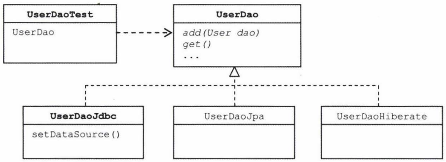

# 예외 전환

#### JDBC의 한계
JDBC
- JDBC는 자바를 이용해 DB에 접근하는 방법을 추상화된 API형태로 정의해놓고,
각 DB업체가 JDBC표준을 따라 만들어진 드라이버를 제공하게 한다.

- 내부 구현은 DB마다 다르겠지만
JDBC의 Connection, Statement, ResultSet등의 표준 인터페이스를 통해 그 기능을 제공해주기 때문에
자바 개발자들은 표준화된 JDBC의 API에만 익숙해지면 DB의 종류에 상관없이 일관된 방법으로 프로그램을 개발할 수 있다.

- 인터페이스를 사용하는 객체지향 프로그래밍 방법의 장점을 잘 경험할 수 있다

하지만 DB종류에 상관없이 사용할 수 있는 데이터 액세스 코드를 작성하는 일은 쉽지 않다.

두 가지 걸림돌 ( DB마다 SQL이 다르고 발생하는 에러의 종류와 원인이 다르다는 것!! )
1. 비표준 SQL
    JDBC 코드에서 SQL을 사용하게 되는데
    SQL은 어느 정도 표준화된 언어이고 몇 가지 표준 규약이 있다지만,

    각 DB마다 제공하는 비표준 문법과 기능이 있다는게 문제다!
    보통 대용량 데이터를 처리하는 경우 성능을 향상시키기 위해 최적화 기법을 SQL에 적용하거나,
    웹 화면의 페이지 처리를 위해 가져오는 로우의 시작위치와 개수를 지정하거나,
    쿼리에 조건을 포함시킨다거나,
    특별한 기능을 제공하는 함수를 SQL에 사용하려고 할 때

    비표준 SQL문장이 만들어진다!

    이렇게 작성된 비표준 SQL은 결국 DAO코드에 들어가고,
    해당 DAO는 특정 DB에 대해 종속적인 코드가 되고 만다.

    다른 DB로 변경하려면 DAO에 담긴 SQL을 적지 않게 수정해야 한다.
    보통은 DB가 자주 변경되지도 않고, 사용하는 DB에 최적화하는 것이 중요하므로
    비표준 SQL을 거리낌없이 사용한다.

    하지만 DB의 변경 가능성을 고려해서 유연하게 만들어야 한다면 SQL은 제법 큰 걸림돌이 된다.

    **해결책**
    - 호환 가능한 표준 SQL만 사용하는 방법
      - 문제점 : 웹 프로그램에서 자주 필요로 하는 페이징 쿼리에서 문제가 된다. 따라서 현실성 없음.
    - DB별로 별도의 DAO를 만들거나 SQL을 외부에 독립시켜서 DB에 따라 변경해 사용하는 방법
      - 스프링의 DI를 적용하기 좋은 방법이다!

2. 호환성 없는 SQLException의 DB 에러정보
    DB를 사용하다가 발생할 수 있는 예외의 원인은 다양하다.
    SQL의 문법 오류도 있고,
    DB커넥션을 가져오지 못했을 수도 있으며,
    테이블이나 필드가 존재하지 않거나,
    키가 중복되거나 다양한 제약조건을 위배하는 시도를 한 경우,
    데드락에 걸렸거나 락을 얻지 못했을 경우 등등

    문제는 DB마다 SQL만 다른 것이 아니라 에러의 종류와 원인도 제각각이다.

    그래서 JDBC는 데이터 처리 중에 발생하는 다양한 예외를
    그냥 SQLException 하나에 모두 담아버린다.

    JDBC API는 이 SQLException 한 가지만 던지도록 설계되어 있다.
    예외가 발생한 원인은 SQLException 안에 담긴 에러 코드와 SQL 상태 정보를 참조해봐야 한다.

    그런데 SQLException의 getErrorCode()로 가져올 수 있는 DB에러 코드는 DB별로 모두 다르다.
    DB 에러 코드는 DB별로 모두 다르다.
    DB 벤더가 정의한 고유한 에러 코드를 사용하기 때문이다.

    ```java
    add() 메서드에서는 새로운 사용자를 등록하다가 키가 중복돼서 예외가 발생하는 경우를 확인하기 위해
    다음의 방법을 사용한다.

    if(e.getErrorCode() == MysqlErrorNumbers.ER_DUP_ENTRY) {
        ... // MysqlErrorNumbers.ER_DUP_ENTRY는 MySQL 전용 코드다!
    }
    ```
    SQLException은 예외가 발생했을 때 DB상태를 담은 SQL 상태정보를 부가적으로 제공한다.
    getSQLState() 메서드로 예외상황에 대한 상태정보를 가져올 수 있다.
    >이 상태정보는 DB별로 달라지는 에러 코드를 대신할 수 있도록,
    >Open Group의 XOPEN SQL 스펙에 정의된 SQL 상태 코드를 따르도록 되어있다.

    즉, DB에 독립적인 에러정보를 얻기 위해서 SQLException은 위와 같은 상태코드를 제공한다.

    그런데 문제는 DB의 JDBC 드라이버에서 SQLException을 담을 상태 코드를 정확하게 만들어주지 않는다는 점이다.
    어떤 경우에는 아예 표준 코드와는 상관없는 엉뚱한 값이 들어 있기도 하고,
    어떤 DB는 클래스 코드까지는 바로 오지만,
    서브클래스 코드는 일체 무시하고 값을 다 0으로 넣는다거나 하는 식이다.

    결과적으로 이 SQL상태 코드를 믿고 결과를 파악하도록 코드를 작성하는 것은 위험하다.

    결국 호환성 없는 에러 코드와 표준을 잘 따르지 않는 상태 코드를 가진 SQLException만으로
    DB에 독립적인 유연한 코드를 작성하는 건 불가능에 가깝다.

#### DB에러 코드 매핑을 통한 전환
앞서 두 번쨰 걸림돌로 다뤘던 SQLException의 비표준 에러 코드와 SQL 상태 정보에 대한 해결책을 알아보자.

SQLException에 담긴 SQL 상태 코드는 신뢰할만한게 아니므로 더 이상 고려하지 않는다.
차라리 DB 업체별로 만들어 유지해오고 있는 DB전용 에러 코드가 더 정확한 정보라고 볼 수 있다.
SQL 상태 코드는 JDBC 드라이버를 만들 때 들어가는 것이므로 같은 DB라고 하더라도 드라이버를 만들 때 마다 달라지기도 하지만, DB에러 코드는 DB에서 직접 제공해주는 것이니 버전이 올라가더라도 어느 정도 일관성이 유지된다.

해결 방법 : DB별 에러 코드를 참고해서 발생한 예외의 원인이 무엇인지 해석해주는 기능을 만드는 것.

      예) 키 값이 중복돼서 중복 오류가 발생하는 경우
      MySQL : 1062
      Oracle : 1
      DB2 : -803
      이렇게 DB마다 에러 코드가 다르다.
이런 에러 코드 값을 확인할 수 있다면, 키 중복 때문에 발생하는 SQLException을 DuplicateUserIdException이라는 의미가 분명히 드러나는 예외로 전환할 수 있다.

DB종류에 상관없이 동일한 상황에서 일관된 예외를 전달받을 수 있다면 효과적인 대응이 가능하다.

스프링은 DataAccessException이라는 SQLException을 대체할 수 있는 런타임 예외를 정의하고 있을 뿐 아니라 DataAccessException의 서브클래스로 세분화된 예외 클래스들을 정의하고 있다.

SQL문법 때문에 발생하는 에러라면 BadSqlGrammarException을,
DB커넥션을 가져오지 못했을 때는 DataAccessResourceFailureException을
데이터의 제약 조건을 위배했거나 일관성을 지키지 않는 작업을 수행했을 때는 DataIntegrityViolationException을,
그중에서도 중복 키 때문에 발생한 경우는 DuplicatedKeyException을 사용할 수 있다.

이 외에도 데이터 액세스 작업 중에 발생할 수 있는 예외상황을 수십 가지 예외로 분류하고
이를 추상화해 정의한 다양한 예외 클래스를 제공한다.

**문제는 DB마다 에러 코드가 제각각이라는 점**

DAO 메서드나 JdbcTemplate등의 코드에서
일일이 DB별로 에러 코드의 종류를 확인하는 작업을 수행하는 건 부담이 너무 큼.

대신 스프링은 DB별 에러 코드를 분류해서 **스프링이 정의한 예외 클래스와 매핑** 해놓은
에러 코드 매핑 정보 테이블을 만들어두고 이를 이용한다.

예를 들면 오라클용으로 에러 코드 정보가 매핑 파일에 담겨있다.

JdbcTemplate은 SQLException을 단지 런타임 예외인 DataAccessException으로 포장하는 것이 아니라
DB의 에러 코드를 DataAccessException 계층 구조의 클래스 중 하나로 매핑해준다.
전환되는 JdbcTemplate에서 던지는 예외는 모두 DataAccessException의 서브클래스 타입이다.

드라이버나 DB메타정보를 참고해서 DB종류를 확인하고 DB별로 미리 준비된
매핑정보를 참고해서 적절한 예외 클래스를 선택하기 때문에
DB가 달라져도 같은 종류의 에러라면 동일한 예외를 받을 수 있는 것이다.

이렇게 JdbcTemplate은 체크 예외인 SQLException을 런타임 예외인 DataAccessException계층구조의 예외로 포장해주기 때문에 add() 메서드에는 예외 포장을 위한 코드(아래 참고)가 필요 없다.
```java
catch(SQLException e){
    if(e.getErrorCode() == MysqlErrorNumbers.ER_DUP_ENTRY)
        throw new DuplicateUserIdException(e);   // 예외 전환!!
    else
        throw new RuntimeException(e);  // 예외 포장!!
}
```
단, add()메서드를 사용하는 쪽에서 중복 키 상황에 대한 대응이 필요한 경우에 참고할 수 있도록
메서드 선언에 DuplicatedKeyException을 명시해주면 편리하다.
```java
JdbcTemplate이 제공하는 예외 전환 기능을 이용하는 add() 메서드

public void add(User user) throws DuplicateKeyException{
    // JdbcTemplate을 이용해 User을 add하는 코드
}
```
이제 DuplicatedKeyException이 발생하면 DB를 변경하더라도 동일한 예외가 던져진다는게 보장된다.
> JdbcTemplate안에서 DB별로 준비된 에러 코드와 비교해서 적절한 예외를 던져주기 때문이다.


예외 처리와 안전한 리소스 반환을 보장해주는 DAO 코드를 만들고 이를 객체지향 설계원리와 디자인 패턴, DI등을 적용해서 깔끔하고 유연하며 단순한 코드로 만드는 방법


#### DAO 인터페이스와 구현의 분리
DAO를 굳이 따로 만들어서 사용하는 이유?
- 데이터 액세스 로직을 담은 코드를 성격이 다른 코드에서 분리해놓기 위해서 (가장 중요한 이유)
- DAO를 분리해서 전략 패턴을 적용해 구현 방법을 변경해서 사용할 수 있게 만들기 위해서이기도 하다.
  > DAO를 사용하는 쪽에서는 DAO가 내부에서 어떤 데이터 액세스 기술을 사용하는지 신경쓰지 않아도 된다.
  > User와 같은 자바빈으로 마늘어진, 특정 기술에 독립적인 단순한 오브젝트를 주고받으면서 데이터 액세스 기능을 사용하기만 하면 된다.

`그런 면에서 DAO는 인터페이스를 사용해 구체적인 클래스 정보와 구현방법을 감추고, DI를 통해 제공되도록 만드는 것이 바람직하다.`

이렇게 DAO의 사용 기술과 구현 코드는 전략 패턴과 DI를 통해 DAO를 사용하는 클라이언트에게 감출 수 있지만, 메서드 선언에 나타나는 예외정보가 문제가 될 수 있다.
UserDao의 인터페이스를 분리해서 기술에 독립적인 인터페이스로 만들려면 아래와 같이 정의해야하는데
```java
public interface UserDao {
    public void add(User user);
}
```
이상적인 메서드 선언은 위와 같다. 하지만 이 메서드 선언은 사용할 수 없다.

DAO에서 사용하는 데이터 액세스 기술의 API가 예외를 던지기 때문이다.
만약 JDBC API를 사용하는 UserDao 구현 클래스의 add()메서드라면 SQLException을 던질 것이다.

**인터페이스의 메서드 선언에는 없는 예외를 구현 클래스 메서드의 throws에 넣을 수는 없다.**
따라서 인터페이스 메서드도 다음과 같이 선언돼야 한다.
```java
public void add(User user) throws SQLException;
```
이렇게 정의한 인터페이스는 JDBC가 아닌 데이터 액세스 기술로 DAO구현을 전환하면 사용할 수 없다.
데이터 액세스 기술의 API는 자신만의 독자적인 예외를 던지기 때문에
다음과 같이 인터페이스 메서드를 바꿔주면 모르겠지만,
SQLException을 던지도록 선언한 인터페이스 메서드는 사용할 수 없다.

```java
public void add(User user) throws PersistentException; // JPA
public void add(User user) throws HibernateException; // Hibernate
public void add(User user) throws JdoException; // JDO
```

결국 인터페이스로 메서드의 구현은 추상화했지만 구현 기술마다 던지는 예외가 다르기 때문에
메서드의 선언이 달라진다는 문제가 발생한다.

DAO 인터페이스를 기술에 완전히 독립적으로 만들려면 예외가 일치하지 않는 문제도 해결해야 한다.

가장 단순한 해결 방법은 모든 예외를 다 받아주는 throws Exception으로 선언하는 것이다.
```JAVA
public void add(User user) throws Exception;
```
간단하지만 무책임한 선언이다.

다행히도 JDBC보다는 늦게 등장한 JDO, Hibernate, JPA등의 기술은 SQLException 같은 체크 예외 대신 런타임 예외를 사용한다.
따라서 throws에 선언을 해주지 않아도 된다.
남은 것은 SQLException을 던지는 JDBC API를 직접 사용하는 DAO뿐인데, 이 경우에는 DAO메서드 내에서 런타임 예외로 포장해서 던져줄 수 있다.
JDBC를 이용한 DAO에서 모든 SQLException을 런타임 예외로 포장해주기만 한다면 DAO메서드는 처음 의도했던 대로 다음과 같이 선언해도 된다.
```
public void add(User user);
```

대부분의 데이터 액세스 예외는 애플리케이션에서는 복구 불가능하거나 할 필요가 없는 것이다.
그렇다고 모든 예외를 다 무시해야 하는 건 아니다.
중복 키 에러처럼 비즈니스 로직에서 의미있게 처리할 수 있는 예외도 있다.
애플리케이션에서는 사용하지 않더라도 시스템 레벨에서 데이터 액세스 예외를 의미있게 분류할 필요도 있다.
문제는 데이터 액세스 기술이 달라지면 같은 상황에서도 다른 종류의 예외가 던져진다는 점이다.
중복 키 에러가 발생했을 때 JDBC로 만든 DAO에서는 SQLException이, JPA에서는 PersistenceException이, 하이버네이트에서는 HibernateException이 던져진다.

따라서 DAO를 사용하는 클라이언트 입장에서는
DAO의 사용 기술에 따라서 예외 처리 방법이 달라져야 한다.
결국 클라이언트가 DAO의 기술에 의존적이 될 수밖에 없다.
단지 인터페이스로 추상화하고,
일부 기술에서 발생하는 체크 예외를 런타임 예외로 전환하는 것만으론 불충분하다.

[DataAccessException](DataAccessException.md)

### 기술에 독립적인 UserDao 만들기

#### 인터페이스 적용
지금까지 만들어서 써왔던 UserDao클래스를 이제 인터페이스와 구현으로 분리해보자.

인터페이스와 구현 클래스의 이름을 정하는 방법은 여러 가지가 있다.
인터페이스를 구분하기 위해 인터페이스 이름 앞에는 I라는 접두어를 붙이는 방법도 있고,
인터페이스 이름은 가장 단순하게 하고 구현 클래스는 각각의 특징을 따르는 이름을
붙이는 경우도 있다.

후자의 방법을 사용해보자.
사용자 처리 DAO의 이름은 UserDao라 하고,
JDBC를 이용해 구현한 클래스의 이름을 UserDaoJdbc라 하자.
> 나중에 JPA나 하이버네이트로 구현한다면 UserDaoJpa, UserDaoHibernate라고 이름을 붙일 수 있다.

UserDao 인터페이스에는 기존 UserDao 클래스에서 DAO의 기능을 사용하려는 클라이언트들이 필요한 것만 추출해내면 된다.
```java
public interface UserDao {
    void add(User user);
    User get(String id);
    List<User> getAll();
    void deleteAll();
    int getCount();
}
```

주의!
public 접근자를 가진 메서드이지만 UserDao의 setDataSource()메서드는 인터페이스에 추가하면 안된다.
setDataSource() 메서드는 UserDao의 구현 방법에 따라 변경될 수 있는 메서드고, UserDao를 사용하는 클라이언트가 알고 있을 필요도 없으므로..

```java
public class UserDaoJdbc implements UserDao {}
```

또 한 가지 변경할 사항은 스프링 설정파일의 userDao 빈 클래스 이름이다.
userDao 빈 클래스를 변경해준다.

```java
<bean id="userDao" class="me.jae57.dao.UserDaoJdbc">
    <property name="dataSource" ref="dataSource"/>
</bean>
```
클래스 이름만 바꿔주면 된다.
빈의 이름은 보통 클래스 이름이 아니라 인터페이스 이름을 따르는 경우가 일반적이므로
구현클래스를 바꿨다고 해서 바꾸진 않는다.

#### 테스트 보완
```JAVA
public class UserDaoTest {
    @Autowired
    private UserDao dao;
}
```
@Autowired는 스프링의 컨텍스트 내에서 정의된 빈 중에서
인스턴스 변수에 주입 가능한 타입의 빈을 찾아준다.

UserDao는 UserDaoJdbc가 구현한 인터페이스이므로
UserDaoTest의 dao변수에 UserDaoJdbc 클래스로 정의된 빈을 넣는데 아무런 문제가 없다.
UserDaoJdbc오브젝트는 UserDao 타입이기 때문이다.

경우에 따라서는 UserDaoJdbc dao라고 선언할 수 있다.
중요한 건 테스트의 관심임.

구현 기술에 상관없이 DAO의 기능이 동작하는 데만 관심이 있다면,
UserDao 인터페이스로 받아서 테스트하는 편이 낫다.

나중에 다른 데이터 액세스 기술로 DAO빈을 변경한다고 하더라도 이 테스트는 여전히 유효하다.
반면 특정 기술을 사용한 UserDao의 구현 내용에 관심을 가지고 테스트하려면
테스트에서 @Autowired로 DI받을 때 UserDaoJdbc나 UserDaoHibernate같이
특정 타입을 사용해야 한다.

일단 UserDao테스트는 DAO의 기능을 검증하는 것이 목적이지
JDBC를 이용한 구현에 관심이 있는 게 아니다.

그러니 UserDao라는 변수 타입을 그대로 두고
스프링 빈을 인터페이스로 가져오도록 만드는 편이 낫다.

UserDao의 인터페이스와 구현을 분리함으로써 데이터 액세스의 구체적인 기술과
UserDao의 클라이언트 사이에 DI가 적용된 모습을 보여준다.
아직 UserDao를 사용하느 애플리케이션 코드를 만들지는 않았지만 일단 테스트를 하나의 클라이언트라 생각해도 좋다.



이제 UserDaoTest에 중복된 키를 가진 정보를 등록했을 때 어떤 예외가 발생하는지를 확인하기 위해
테스트를 하나 추가해보자.
이것은 UserDao의 로직을 테스트하기 위해서라기보다는 스프링이 데이터 액세스 예외를 다루는 기능을 직접 확인해보기 위한 것이니 일종의 학습 테스트다.

일반적으로 학습테스트는 애플리케이션 코드에 대한 테스트와 분리해서 만드는 게 좋지만
UserDaoTest에 넣어보겠다.

```java
DataAccessException에 대한 테스트

@Test(expected = DataAccessException.class)
public void duplicateKey(){
  dao.deleteAll();
  dao.add(user1);
  dao.add(user1); // 강제로 사용자를 두 번 등록하므로 예외가 발생해야 한다.
}
```
예외가 발생하면 이 테스트는 성공이다.
성공한 경우 DataAccessException타입의 예외가 던져졌음은 분명한데,
DataAccessException의 서브클래스일 수 있으므로 구체적으로 어떤 예외인지 확인해볼 필요가 있다.
이런 경우 어떤 예외가 발생했나 확인해보려면 테스트를 실패하게 만들면 된다.
expected=DataAccessException.class 부분을 빼고 테스트를 실행해보자.

```java
nested exception is com.mysql.jdbc.exceptions.jdbc4.MySQLIntegrityConstraintViolationException

DataIntegrityViolationException의 한 종류다.
```
