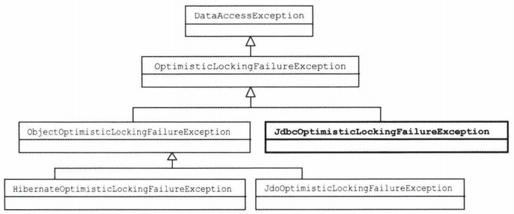

# DataAccessException

용도
- JDBC의 SQLException을 전환한다.
- JAVA 데이터 액세스 기술에서 발생하는 예외에도 적용한다.

스프링이 제공하는 `데이터 액세스 기술에 독립적인 추상화된 예외`다!

스프링이 DataAccessException 계층구조를 이용해 기술에 독립적인 예외를 정의하고 사용하게하는 이유

---
#### Data Access를 위한 JAVA 표준 기술
> 자바의 표준 persistence 기술
- JDBC
- :::::::::::::::: 성격과 사용 방법이 크게 다르다.
- JDO
- JPA
- TopLink
  - Oracle
  - 상용제품
- 하이버네이트
  - 오픈소스
  - 표준을 따르긴 하지만 독자적인 프로그래밍 모델을 지원하는 ORM기술
- iBatis
  - JDBC를 기반으로 하고, 성격도 비슷하지만 사용방법과 API, 발생하는 예외가 다름

`자바에는 이렇게 다양한 데이터 액세스 기술이 존재하지만`
`DataAccessException은 의미가 같은 예외라면 데이터 액세스 기술의 종류에 상관없이 일관된 예외가 발생하도록 만들어준다!`

---

#### DataAccessException 계층구조
> 스프링은 자바의 다양한 데이터 액세스 기술을 사용할 때 발생하는 예외들을 추상화해서 DataAccessException 계층구조 안에 정리해놓았다.

스프링의 JdbcTemplate은 SQLException의 에러 코드를 DB별로 매핑해서 그에 해당하는 의미 있는 DataAccessException의 서브클래스 중 하나로 전환해서 던져준다.
그렇다고 DataAccessException 클래스들이 단지 JDBC의 SQLException을 전환하는 용도로만 쓰이는 건 아니다.

DataAccessException은 자바의 주요 데이터 액세스 기술에서 발생할 수 있는
대부분의 예외를 추상화하고 있다.

데이터 액세스 기술에 상관없이 공통적인 예외도 있지만 일부 기술에서만 발생하는 예외도 있다.
JPA, 하이버네이트처럼 ORM에서는 발생하지만 JDBC에는 없는 예외가 있다.

스프링의 DataAccessException은 이런 일부 기술에서만 공통적으로 나타나는 예외를 포함해서
데이터 액세스 기술에서 발생 가능한 대부분의 예외를 계층구조로 분류해놓았다.

예를 들어
```java
InvalidDataAccessResourceUsageException 예외

JDBC, JDO, JPA, 하이버네이트에 상관없이 데이터 액세스 기술을 부정확하게 사용했을 때
거의 대부분 프로그램을 잘못 작성해서 발생하는 오류

=> 이 예외 던져주면 시스템 레벨의 예외처리 작업을 통해 개발자에게 빠르게 통보해준다.
```
이를 다시 세분화하면
```java
BadSqlGrammarException 예외

JDBC에서 발생
```
```java
HibernateQueryException 예외

하이버네이트에서 발생
```
```java
TypeMismatchDataAccessException 예외

잘못된 타입을 사용하려고 했을 때 발생
```

---
JDO, JPA, 하이버네이트는 오브젝트/엔티티 단위로 정보를 업데이트하는데
이 경우 **낙관적인 락킹optimistic locking** 이 발생할 수 있다.
> **낙관적인 락킹**
> 같은 정보를 두 명 이상의 사용자가 동시에 조회하고 순차적으로 업데이트 할 때,
> 뒤늦게 업데이트한 것이 먼저 업데이트한 것을 덮어쓰지 않도록 막아주는 데 쓸 수 있는 편리한 기능이다.

이런 예외들은 사용자에게 적절한 안내 메시지를 보여주고, **다시 시도할 수 있도록 해줘야** 한다.
JDO, JPA, 하이버네이트 각각이 다른 종류의 낙관적인 락킹 예외를 발생시킨다.

`스프링 예외 전환 방법을 적용하면 기술에 상관없이
DataAccessException의 서브클래스인
ObjectOptimisticLockingFailureException으로 통일시킬 수 있다.`

---

ORM 기술은 아니지만 JDBC 등을 이용해 직접 낙관적인 락킹 기능을 구현했다고 해보자.
ObjectOptimisticLockingFailureException의 슈퍼클래스인 OptimisticLockingFailureException을 상속해서
JdbcOptimisticLockingFailureException을 정의해 사용할 수도 있다.

기술에 상관없이 낙관적인 락킹이 발생했을 때 일관된 방식으로 예외처리를 해주려면
OptimisticLockingFailureException을 잡도록 만들면 된다.

어떤 데이터 액세스 기술을 사용했는지에 상관없이 낙관적인 락킹을 처리하는 코드를 만들어낼 수 있다.



---

템플릿 메서드나 DAO메서드에서 직접 활용할 수 있느 예외도 정의되어 있다.

JdbcTemplate의 queryForObject() 메서드는 한 개의 로우만 돌려주는 쿼리에 사용하도록 되어 있다.
쿼리 실행 결과가 하나 이상의 로우를 가져오면, 템플릿 메서드의 사용 방법에 문제가 있거나 SQL을 잘못 작성한 것이다.
이런 경우 JDBC에서는 예외가 발생하지 않는다.
하지만 JdbcTemplate에서 볼 때는 기대한 결과가 나오지 않은 예외상황이다.
이런 경우에 사용할 수 있도록 DataAccessException 계층구조에는
IncorrectResultSizeDataAccessException이 정의되어 있다.

queryForObject()에서는 좀 더 자세한 정보를 담은 서브클래스인
EmptyResultDataAccessException을 발생시킨다.

`JdbcTemplate과 같이 스프링의 데이터 액세스 지원 기술을 이용해 DAO를 만들면 사용 기술에 독립적인 일관성 있는 예외를 던질 수 있다.`
결국 인터페이스 사용, 런타임 예외 전환과 함께 DataAccessException예외 추상화를 적용하면 데이터 액세스 기술과 구현 방법에 독립적인 이상적인 DAO를 만들 수가 있다.


#### DataAccessException 활용 시 주의사항

스프링을 활용하면 DB종류나 데이터 액세스 기술에 상관없이
키 값이 중복이 되는 상황에서는 동일한 예외가 발생하리라고 기대할 것이다.

DuplicateKeyException은 아직까지는 JDBC를 이용하는 경우에만 발생한다.

데이터 액세스 기술을 하이버네이트나 JPA를 사용했을 때도 동일한 예외가 발생할 것으로 기대하지만 실제로 다른 예외가 던져진다.

그 이유는 SQLException에 담긴 DB의 에러 코드를 바로 해석하는 JDBC의 경우와 달리 JPA나 하이버네이트, JDO등에서는 **각 기술이 재정의한 예외** 를 가져와 스프링이 최종적으로 DataAccessException으로 변환하는데, DB의 에러코드와 달리 **이런 예외** 들은 세분화되어 있지 않기 때문이다.
```java
예
하이버네이트 중복 키가 발생하는 경우
ConstraintViolationException
=>
포괄적인 예외
DataIntegrityViolationException
로 스프링이 변환함.
```

DuplicateKeyException도 DataIntegrityViolationException의 한 종류다.
따라서 expected = DataIntegrityViolationException으로 해준다면
하이버네이트로 만든 DAO로 바꾼다고 하더라도 동일한 예외를 기대할 수는 있다.

하지만 제약조건을 위반하는 다른 상황에서도 동일한 예외가 발생하기 때문에 DuplicateKeyException을 이용하는 경우에 비해서는 이용가치가 떨어진다.

DataAccessException이 기술에 상관없이 어느 정도 추상화된 공통 예외로 변환해주긴 하지만 근본적인 한계 때문에 완벽하다고 기대할 수는 없다.
따라서 사용에 주의를 기울여야 한다.
DataAccessException을 잡아서 처리하는 코드르 만들려고 한다면 미리 학습테스트를 만들어서 실제로 전환되는 예외의 종류를 확인해둘 필요가 있다.

만약 DAO에서 사용하는 기술의 종류와 상관없이 동일한 예외를 얻고 싶다면 DuplicatedUserIdException처럼 직접 예외를 정의해두고, 각 DAO의 add()메서드에서 좀 더 상세한 예외 전환을 해줄 필요가 있다.

하이버네이트 예외의 경우라도 중첩된 예외로 SQLException이 전달되기 때문에 이를 다시 스프링의 JDBC 예외 전환 클래스의 도움을 받아서 처리할 수 있다.

학습 테스트를 하나 더 만들어서 SQLException을 직접 해석해 DataAccessException으로 변환하는 코드의 사용법을 살펴보자.

스프링은 SQLException을 DataAccessException으로 전환하는 다양한 방법을 제공한다
- DB 에러 코드를 이용하는 것
SQLException을 코드에서 직접 전환하고 싶다면 SQLExceptionTranslator 인터페이스를 구현한 클래스 중에서 SQLErrorCodeSQLExceptionTranslator를 사용하면 된다.

이 SQLErrorCodeSQLExceptionTranslator는 에러 코드 변환에 필요한 DB의 종류를 알아내기 위해 현재 연결된 DataSource를 필요로 한다. UserDaoTest에 DataSource변수를 추가해서 DataSource타입의 빈을 받아두도록 한다.
```java
public class UserDaoTest {
    @Autowired
    UserDao dao;

    @Autowired
    DataSource dataSource;
}
```

이 DataSource를 사용해 SQLException에서 직접 DuplicateKeyException으로 전환하는 기능을 확인해보는 학습테스트다.

JDBC 외의 기술을 사용할 때도 DuplicateKeyException을 발생시키려면 SQLException을 가져와서 직접 예외 전환을 하는 방법을 생각해볼 수도 있다.

또는 JDBC를 이용하지만 JdbcTemplate과 같이 자동으로 예외를 전환해주는 스프링의 기능을 사용할 수 없는 경우라도 SQLException을 그대로 두거나 의미없는 RuntimeException으로 뭉뚱그려서 던지는 대신 스프링의 DataAccessException 계층의 예외로 전환하게 할 수 있다. 
