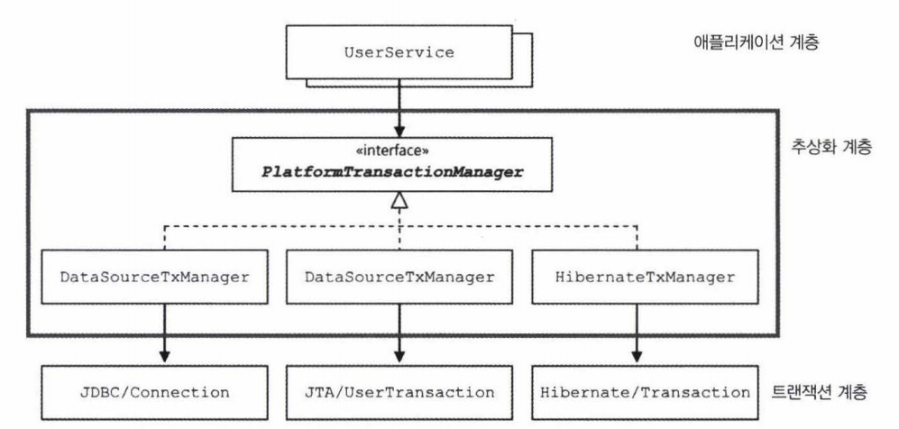

테스트의 기본은 자동화


작업 중간에 예외를 강제로 발생시키도록 코드를 수정해보자.
그러나, 테스트를 위해 코드를 함부로 건드리는 것은 위험하므로
테스트용으로 특별히 만든 대역을 사용하자.

테스트에서만 사용할 클래스라면 번거롭게 파일을 만들지 말고 테스트 클래스 내부에 스태틱 클래스로 만드는 것이 간편하다.


#### 트랜잭션 문제!
트랜잭션 : 더 이상 나눌 수 없는 단위 작업
작업을 쪼개서 작은 단위로 만들 수 없다는 것은 트랜잭션의 핵심 속성인 원자성을 의미한다

### 트랜잭션 경계설정
하나의 SQL 명령을 처리하는 경우는 DB가 트랜잭션을 보장해준다고 믿을 수 있다.
그러나 여러 개의 SQL이 사용되는 작업을 하나의 트랜잭션으로 취급해야 하는 경우도 있다.
계좌이체나 레벨 수정 작업등이 그렇다

두 가지 작업이 하나의 트랜잭션이 되려면, 두번째 SQL이 성공적으로 DB에서 수행되기 전에
문제가 발생할 경우에는 앞에서 처리한 SQL작업도 취소시켜야 한다
이런 취소 작업을 트랜잭션 롤백(transaction rollback)이라 함

여러 개의 SQL을 하나의 트랜잭션으로 처리하는 경우에 모든 SQL 수행 작업이 다 성공적으로 마무리됐다고
DB에 알려줘서 작업을 확정시켜야 한다
이것을 트랜잭션 커밋(transaction commit)

### JDBC 트랜잭션의 트랜잭션 경계설정
트랜잭션은 시작하는 지점과 끝나는 지점이 있다 => 트랜잭션의 경계
복잡한 로직의 흐름 사이에서 정확하게 트랜잭션 경계를 설정하는 일은 매우 중요한 작업

시작하는 방법은 한가지 + 끝나는 방법은 두가지(롤백, 커밋)

JDBC의 트랜잭션은 하나의 Connection을 가져와 사용하다가 닫는 사이에 일어남
트랜잭션의 시작과 종료는 Connection 오브젝트를 통해 이뤄짐

JDBC에서 트랜잭션을 시작하려면 자동 커밋 옵션을 false로 만들어주면 된다

JDBC의 기본 설정은 DB작업을 수행한 직후에 자동으로 커밋이 되도록 되어있다.
따라서 setAutoCommit(false)명령으로 자동커밋 기능을 꺼주면
새로운 트랜잭션이 시작되게 만들 수 있다.

트랜잭션이 한 번 시작되면 commit() 또는 rollback()메서드가
호출될 때까지의 작업이 하나의 트랜잭션으로 묶인다.

트랜잭션의 경계설정 transaction demarcation
setAutoCommit(false)로 트랜잭션의 시작을 선언하고
commit() 또는 rollback()으로 트랜잭션을 종료하는 작업

트랜잭션의 경계는 하나의 Connection이 만들어지고 닫히는 범위 안에 존재한다

하나의 DB커넥션 안에서 만들어지는 트랜잭션을
local transaction이라고도 한다.

demarcate 경계를 표시하다
demarcation 경계, 구분

일반적으로 트랜잭션은 커넥션보다 존재 범위가 짧다
따라서 템플릿 메서드가 호출될 때마다 트랜잭션이 새로 만들어지고 메서드를 빠져나오기 전에 종료된다
결국 JdbcTemplate의 메서드를 사용하는 UserDao는 각 메서드마다 하나씩의 독립적인 트랜잭션으로
실행될 수 밖에 없다

JDBC의 트랜잭션 경계 설정 메서드는 모두
Connection 오브젝트를 사용하게 되어 있는데,
JdbcTemplate을 사용한 이후로 Connection 오브젝트는 구경도 못해봤다.

JDBCTemplate은
하나의 템플릿 메서드 안에서
DataSource의 getConnection()메서드를 호출해서 Connection 오브젝트를 가져오고,
작업을 마치면 Connection을 확실하게 닫아주고
템플릿 메서드를 빠져나온다.

즉, 템플릿 메서드 호출 한 번에 한 개의 DB커넥션이 만들어지고 닫히는 일까지 일어난다.

여러 번 DB에 업데이트를 해야 하는 작업을 하나의 트랜잭션으로 만들려면 어떻게 해야 할까?

어떤 일련의 작업이 하나의 트랜잭션으로 묶이려면 DB커넥션도 하나만 사용돼야 한다. 트랜잭션은 Connection 오브젝트 안에서 만들어지기 때문이다.

UserService와 UserDao를 그대로 둔 채로 트랜잭션을 적용하려면 결국 트랜잭션의 경계설정 작업을 UserService쪽으로 가져와야 한다.

UserDao가 가진 SQL이나 JDBC API를 이용한 데이터 액세스 코드는 최대한 그대로 남겨둔 채로,
UserService에는 트랜잭션 시작과 종료를 담당하는 최소한의 코드만 가져오게 만들면
어느 정도 책임이 다른 코드를 분리해둔 채로 트랜잭션 문제를 해결할 수 있다

### UserService 트랜잭션 경계 설정의 문제점
1
그런데 그렇게 되면 DB커넥션을 비롯한 리소스의 깔끔한 처리를 가능하게 했던 JdbcTemplate을 더 이상 활용할 수 없다
결국 JDBC API를 직접 사용하는 초기방식으로 돌아가야 한다

2
DAO의 메서드와 비즈니스 로직을 담고 있는 UserService의 메서드에 Connection 파라미터가 추가돼야 한다는 것
upgradeLevels()에서 사용하는 메서드의 어딘가에서 DAO를 필요로 한다면, 그 사이의 모든 메서드에 걸쳐
Connection 오브젝트가 계속 전달돼야 함

=> UserService는 스프링 빈으로 선언해서 싱글톤으로 되어 있으니 UserService의 인스턴스 변수에 이 Connection을 저장해뒀다가 다른 메서드에서 사용하게 할 수도 없음. 그러면 stateful해져서
멀티스레드 환경에서 위험함. 공유하는 인스턴스 변수에 스레드별로 생성하는 정보를 저장하다보면
서로 덮어쓰는 일이 발생하기 때문이다

3
문제점2에 이어서
Connection파라미터가 메서드에 추가된다는 것 = 데이터 액세스 기술에 독립적일 수 없다
JPA나 하이버네이트로 UserDao의 구현 방식을 변경하려고 하면 Connection 대신 EntityManager나 Session오브젝트를 UserDao 메서드가 전달받도록 해야함.

결국 UserDao 인터페이스는 바뀔 것이고, 그에 따라 UserService코드도 함께 수정돼야함

### Connection 파라미터 제거
그런데 앞서 생각했던
파라미터를 통해 Connection을 전달하는 방법
=> 결국 upgradeLevels()메서드가 트랜잭션 경계설정을 해야한다는 것이다
( Connection을 생성하고 트랜잭션 시작과 종료를 관리 )

일단은
생성된 Connection 오브젝트를 계속 메서드의 파라미터로 전달하다가
DAO를 호출할 때 사용하게 하는 것 피하고 싶다
=>  스프링이 제안하는 방법은
독립적인 트랜잭션 동기화 방식(transaction synchronization)이다.

트랜잭션 동기화 : UserService에서 트랜잭션을 시작하기 위해 만든 Connection 오브젝트를 특별한 저장소에 보관해두고, 이후에 호출되는 DAO의 메서드에서는 저장된 Connection을 가져다가 사용하게 하는 것이다.

즉, DAO가 사용하는 JdbcTemplate이 트랜잭션 동기화 방식을 이용하도록 하자.
트랜잭션이 모두 종료되면, 동기화를 마치면 된다.

트랜잭션 동기화 방식을 사용하는 경우의 작업 흐름
1. UserService는 Connection 생성
2. 트랜잭션 동기화 저장소에 저장해두고 Connection의 setAutoCommit(false)를 호출, 트랜잭션 시작,
  DAO의 기능 이용 시작
3. update() 메서드가 호출
4. update() 메서드 내부에서 이용하는 JdbcTemplate메서드에서 트랜잭션 동기화 저장소에
  현재 시작된 트랜잭션을 가진 Connection 오브젝트가 존재하는지 확인
5. upgradeLevels()메서드 시작 부분에서 저장해둔 Connection을 발견하고 가져온다
6. 가져온 Connection을 이용해 PreparedStatement를 만들어 수정 SQL을 실행한다
7. 트랜잭션 동기화 저장소에서 DB커넥션을 가져왔을 때는 JdbcTemplate은 Connection을 닫지 않은 채로 작업을 마친다.
8. 여전히 Connection은 열려 있고 트랜잭션은 실행중인 채로 트랜잭션 동기화 저장소에 있다
9. 두 번 째 update()가 호출되면 3-8과정을 반복한다.
10. 트랜잭션 내의 모든 작업이 정상적으로 끝나면 UserService는 이제 Connection의 commit()을 호출해서
  트랜잭션을 완료시킨다
11. 트랜잭션 저장소가 더 이상 Connection 오브젝트를 저장해두지 않도록 이를 제거한다
12. 예외상황이 발생하면 UserService는 즉시 Connection의 rollback()을 호출하고 트랜잭션을 종료할 수 있다.
13. 트랜잭션 저장소에 저장된 동기화된 Connection 오브젝트는 제거해줘야한다

트랜잭션 동기화 저장소는 작업 스레드마다 독립적으로 Connection오브젝트를 저장하고 관리하기 때문에 다중 사용자를 처리하는 서버의 멀티 스레드 환경에서도 충돌이 날 염려가 없다.

### 트랜잭션 동기화 적용
멀티스레드 환경에서도 안전한 트랜잭션 동기화 방법을 구현하는 일이 기술적으로 간단하지 않다.

스프링은 JdbcTemplate과 더불어 이런 트랜잭션 동기화 기능을 지원하는 간단한 유틸리티 메서드를 제공한다.

스프링이 제공하는 트랜잭션 동기화 클래스는 TransactionSynchronizatonManager임.
1
이 클래스를 이용해 먼저 트랜잭션 동기화 작업을 초기화하도록 요청한다

2
DataSourceUtils에서 제공하는 getConnection() 메서드를 통해 DB커넥션을 생성
DataSource에서 Connection을 직접 가져오지 않고
스프링이 제공하는 유틸리티 메서드를 쓰는 이유 ?
DataSourceUtils의 getConnection() 메서드는 Connection 오브젝트를 생성해줄뿐 아니라
트랜잭션 동기화에 사용하도록 저장소에 바인딩해주기 때문!

3
동기화가 준비됐으면 트랜잭션을 시작하고 DAO의 메서드를 사용하는 트랜잭션 내의 작업을 진행한다
트랜잭션 동기화가 되어 있는 채로 JdbcTemplate을 사용하면 JdbcTemplate의 작업에서 동기화시킨 DB커넥션을
사용하게 된다
결국 UserDao를 통해 진행되는 모든 JDBC 작업은 upgradeLevels() 메서드에서 만든 Connection 오브젝트를
사용하고 같은 트랜잭션에 참여하게 된다

4
작업을 정상적으로 마치면 트랜잭션을 커밋해준다
그리고 스프링 유틸리티 메서드의 도움을 받아 커넥션을 닫고 트랜잭션 동기화를 마치도록 요청한다
만약 예외 발생하면 트랜잭션을 롤백해준다
DB커넥션을 닫는 것과 동기화 작업 중단은 동일하게 진행해야 한다

5
JDBC의 트랜잭션 경계설정 메서드를 사용해 트랜잭션을 이용하는
전형적인 코드에 간단한 트랜잭션 동기화 작업만 붙여줌으로써,
지저분한 Connection 파라미터의 문제를 깔끔히 해결


* 트랜잭션 동기화 방식을 적용한 UserService
  - Connection을 생성할 때 사용할 DataSource를 DI받도록 한다. (트랜잭션 동기화를 위해 필요)
  - 트랜잭션 동기화 관리자를 이용해 동기화 작업을 초기화한다.
  - DB커넥션을 생성하고 트랜잭션을 시작한다. 이후의 DAO 작업은 모두 여기서 시작한 트랜잭션 안에서 진행된다.

### JdbcTemplate과 트랜잭션 동기화
스스로 Connection을 생성해서 사용한다.

JdbcTemplate은 영리하게 동작하도록 설계되어 있다.
만약 미리 생성돼서 트랜잭션 동기화 저장소에 등록된 DB커넥션이나 트랜잭션이 없는 경우에는
JdbcTemplate이 직접 DB커넥션을 만들고 트랜잭션을 시작해서 JDBC작업을 진행한다.

반면 upgradeLevels() 메서드에서처럼 트랜잭션 동기화를 시작해놓았다면 그때부터 실행되는 JdbcTemplate의 메서드에서는 직접 DB커넥션을 만드는 대신 트랜잭션 동기화 저장소에 들어 있는 DB커넥션을 가져와서 사용한다. 이를 통해 이미 시작된 트랜잭션에 참여하는 것이다.

따라서 DAO를 사용할 때 트랜잭션이 굳이 필요 없다면 바로 호출해서 사용해도 되고, DAO 외부에서 트랜잭션을 만들고 이를 관리할 필요가 있다면 미리 DB 커넥션을 생성한 다음 트랜잭션 동기화를 해주고 사용하면 된다.
트랜잭션 동기화를 해주고 나면 DAO에서 사용하는 JdbcTemplate은 자동으로 트랜잭션 안에서 동작할 것이다.

JdbcTemplate이 제공해주는 유용한 기능 세가지
JDBC코드의 try/catch/finally 작업 흐름 지원
SQLException의 예외 변환
트랜잭션 동기화

## 트랜잭션 서비스 추상화

### 여러 개의 DB에 모두 데이터를 넣고 싶다는 요구
한 개 이상의 DB로의 작업을 하나의 트랜잭션으로 만드는 건
Jdbc의 Connection을 이용한 트랜잭션 방식인 로컬 트랜잭션으로는 불가능하다.
왜냐하면 로컬 트랜잭션은 하나의 DB Connection에 종속되기 때문이다.
따라서 각 DB와 독립적으로 만들어지는 Connection을 통해서가 아니라,
별도의 트랜잭션 관리자를 통해 트랜잭션을 관리하는 글로벌 트랜잭션 global transaction 방식을 사용해야 한다.

글로벌 트랜잭션을 적용해야 트랜잭션 매니저를 통해 여러 개의 DB가 참여하는 작업을 하나의 트랜잭션으로 만들 수 있다.
( JMS_JavaMessageService와 같은 트랜잭션 기능을 지원하는 서비스도 트랜잭션에 참여시킬 수 있다. )

자바는 JDBC 외에 이런 글로벌 트랜잭션을 지원하는 트랜잭션 매니저를 지원하기 위한 API인
JTA(Java Transaction API)를 제공하고 있다.

* JTA를 이용해 여러 개의 DB 또는 메시징 서버에 대한 트랜잭션을 관리하는 방법을 알아보자.
- DB는 JDBC, 메시징 서버라면 JMS같은 API를 사용해서 필요한 작업을 수행한다
- 트랜잭션은 JDBC나 JMS API를 사용해서 직접 제어하지 않고 JTA를 통해 트랜잭션 매니저가 관리하도록 위임한다
- 트랜잭션 매니저는 DB와 메시징 서버를 제어하고 관리하는 각각의 리소스매니저와 XA 프로토콜을 통해 연결
=> 이를 통해 트랜잭션 매니저가 실제 DB와 메시징 서버의 트랜잭션을 종합적으로 제어할 수 있게 된다

JTA를 이용해 트랜잭션 매니저를 활용하면 여러 개의 DB나 메시징 서버에 대한 작업을 하나의 트랜잭션으로 통합하는
분산 트랜잭션 또는 글로벌 트랜잭션이 가능해진다

* 하나 이상의 DB가 참여하는 트랜잭션을 만들려면 JTA를 사용해야한다.

[ JTA를 이용한 트랜잭션 처리 코드의 전형적인 구조 ]
```java
InitialContext ctx = new InitialContext();
UserTransaction tx = (UserTransaction)ctx.lookup(USER_TX_JNDI_NAME);
// JNDI를 이용해 서버의 UserTransaction 오브젝트를 가져온다.

tx.begin();
Connection c = dataSource.getConnection();  // JNDI로 가져온 dataSource를 사용해야한다
try {
    // 데이터 액세스 코드
    tx.commit();
} catch( Exception e) {
    tx.rollback();
    throw e;
} finally {
    c.close();
}
```

문제는
JDBC 로컬 트랜잭션을 JTA를 이용하는 글로벌 트랜잭션으로 바꾸려면 UserService의 코드를 수정해야 한다는 점이다
즉, UserService는 자신의 로직이 바뀌지 않았음에도 기술환경에 따라서 코드가 바뀌는 코드가 돼버림

하이버네이트를 이용한 트랜잭션 관리 코드는 JDBC나 JTA의 코드와는 또 다르다
하이버네이트는 Connection을 직접 사용하지 않고 Session이라는 걸 사용하고,
독자적인 트랜잭션 관리 API를 사용함

### 트랜잭션 API의 의존관계 문제와 해결책

UserService의 코드가 특정 트랜잭션 방법에 의존적이지 않고 독립적일 수 있게 만들려면 어떻게 ?

UserService의 메서드 안에서 트랜잭션 경계설정 코드를 제거할 수는 없다.

하지만 특정 기술에 의존적인 Connection, UserTransaction, Session/Transaction API등에
종속되지 않게 할 수 있는 방법은 있다.

트랜잭션의 경계 설정을 담당하는 코드는 일정한 패턴을 갖는 유사한 구조다.
이렇게 여러 기술의 사용방법에 공통점이 있다면 추상화를 생각해볼 수 있다.

추상화란 하위 시스템의 공통점을 뽑아내서 분리시키는 것을 말한다.

유사한 예로,
DB에서 제공하는 DB클라이언트 라이브러리와 API는 서로 전혀 호환되지 않는 독자적인 방식으로 만들어져 있다.

하지만 모두 SQL을 이용하는 방식이라는 공통점이 있다.
이 공통점을 뽑아내 추상화한 것이 JDBC다.

JDBC라는 추상화 기술이 있기 때문에 자바의 DB프로그램 개발자는
DB의 종류에 상관없이 일관된 방법으로 데이터 액세스 코드를 작성할 수 있다.

### 트랜잭션 처리 코드의 추상화
JDBC, JTA, 하이버네이트, JPA, JDO 심지어는 JMS도 트랜잭션 개념을 갖고 있다.
모두 트랜잭션 경계설정 방법에 공통점이 있다.

이 공통적인 특징을 모아서 추상화된 트랜잭션 관리 계층을 만들 수 있다. 그리고 애플리케이션 코드에서는 트랜잭션 추상계층이 제공하는 API를 이용해 트랜잭션을 이용하게 만들어준다면 특정 기술에 종속되지 않는 트랜잭션 경계설정 코드를 만들 수 있다.

스프링은 트랜잭션 기술의 공통점을 담은 트랜잭션 추상화 기술을 제공하고 있다.
이를 이용하면 애플리케이션에서 직접 각 기술의 트랜잭션 API를 이용하지 않고도,
일관된 방식으로 트랜잭션을 제어하는 트랜잭션 경계설정 작업이 가능해진다.

### 트랜잭션 API의 의존관계 문제와 해결책

UserService에 트랜잭션 경계설정 코드를 도입한 후에
JDBC 트랜잭션 API와 JdbcTemplate과 동기화하는 API로 인해
JDBC DAO에 의존하게 된다.

### 스프링의 트랜잭션 서비스 추상화
스프링은 트랜잭션 기술의 공통점을 담은 트랜잭션 추상화 기술을 제공한다.
이를 이용하면 일관된 방식으로 트랜잭션을 제어하는 트랜잭션 경계설정 작업이 가능해진다.


```java
public void upgradeLevels() {
    PlatformTransactionManager transactionManager = new DataSourceTransactionManager(dataSource);

    트랜잭션 시작; //TransactionStatus status = transactionManager.getTransaction(new DefaultTransactionDefinition());

    try{
        트랜잭션 안에서 진행되는 작업;

        트랜잭션 커밋; // transactionManager.commit(status);
    } catch (RuntimeException e){
        트랜잭션 롤백; // transactionManager.rollback(status);
    }
}
```
스프링이 제공하는 트랜잭션 경계설정을 위한 추상 인터페이스는 PlatformTransactionManager다.
JDBC의 로컬 트랜잭션을 이용한다면 PlatformTransactionManager를 구현한 DataSourceTransactionManager를
사용하면 된다.
사용할 DB의 DataSource를 생성자 파라미터로 넣으면서 DataSourceTransactionManager의 오브젝트를 만든다

JDBC를 이용하는 경우
먼저 Connection을 생성하고 나서 트랜잭션을 시작했지만
PlatformTransactionManager에서는 트랜잭션을 가져오는 요청인 getTransaction() 메서드 자체에서
DB커넥션을 가져오는 작업도 함께 수행하므로 호출만 하면 된다.

파라미터로 넘기는 DefaultTransactionDefinition 오브젝트는 트랜잭션에 대한 속성이 담겨있다

시작된 트랜잭션은 TransactionStatus 타입의 변수에 저장된다.
TransactionStatus는 트랜잭션에 대한 조작이 필요할 때 PlatformTransactionManager메서드의 파라미터로
전달해주면 됨.

스프링의 트랜잭션 추상화 기술은 트랜잭션 동기화를 사용(제공)한다
따라서, PlatformTransactionManager로 시작한 트랜잭션은 트랜잭션 동기화 저ㅏㅇ소에 저ㅏㅇ된다.

PlatformTransactionManager를 구현한 DataSourceTransactionManager오브젝트는 JdbcTemplate에서 사용될 수 있는 방식으로 트랜잭션을 관리해준다

따라서 PlatformTransactionManager를 통해 시작한 트랜잭션은 UserDao의 JdbcTemplate안에서 사용된다

트랜잭션 작업을 모두 수행한 후에는
돌려받은 TransactionStatus 오브젝트를 파라미터로 PlatformTransactionManager의 commit() 메서드를
호출하면 된다
예외가 발생하면 rollback()


스프링의 트랜잭션 추상화 기술은 트랜잭션 동기화를 사용한다.
PlatformTransactionManager로 시작한 트랜잭션은 트랜잭션 동기화 저장소에 저장된다.

DataSourceTransactionManager 오브젝트는 JdbcTemplate에서 사용될 수 있는 방식으로 트랜잭션을 관리해준다.
> 따라서 해당 구현클래스를 통해 시작된 트랜잭션은 UserDao의 JdbcTemplate 안에서 사용된다.

### 트랜잭션 기술 설정의 분리

이제 트랜잭션 추상화 API를 적용한 UserService코드에서
JTA를 이용하는 글로벌 트랜잭션으로 변경하려면 어떻게 ?

PlatformTransactionManager 구현 클래스를 DataSourceTransactionManager에서
JTATransactionManager로 바꿔주기만 하면 된다.

JTATransactionManager는 주요 자바 서버에서 제공하는 JTA 정보를 JNDI를 통해 자동으로 인식하는 기능을 가짐.
따라서, 설정 없이 JTATransactionManager를 사용하기만 해도 트랜잭션 매니저/서비스와 연동해 동작한다.

하지만 어떤 트랜잭션 매니저 구현 클래스를 사용할지 UserService 코드가 알고 있는 것은 DI원칙에 위배
=> 스프링 DI방식으로 바꾸자

어떤 클래스든 스프링의 빈으로 등록할 때 먼저 검토해야할 것은 싱글톤으로 만들어져 여러 스레드에서 동시에 사용해도
괜찮은가
상태를 갖고있고, 멀티스레드 환경에서 안전하지 않은 클래스를 빈으로 무작정 등록하면 심각한 문제 발생함

그러나 스프링이 제공하는! 모든 PlatformTransactionManager의 구현 클래스는 싱글톤으로 사요 가능하다.
안심..

UserService는 이제 PlatformTransactionManager만 있으면 Connection 생성과 트랜잭션 경계설정 기능을 모두 이용할 수 있다
UserService에 추가했던 DataSource는 제거해도되고 이는 이제 PlatformTransactionManager 타입의 빈에서 필요하다.

글로벌 트랜잭션 매니저인 JtaTransactionManager는 애플리케이션 서버의 트랜잭션 서비스를 이용하기 때문에
직접 DataSource와 연동할 필요는 없다
대신 JTA를 사용하는 경우는 DataSource도 서버에서 제공해주는 것을 사용해야 한다.


> UserService를 트랜잭션 기술에서 완전히 독립시켜보자.


|UserService|트랜잭션 추상화 API|구현클래스||
|--|--|--|--|
|upgradeLevels() 내부|PlatformTransactionManager|DataSourceTransactionManager|JDBC의 로컬 트랜잭션 이용|
|||JTATransactionManager|JTA를 이용하는 글로벌 트랜잭션 이용|
|||HibernateTransactionManager||
|||JPATransactionManager||
| 애플리케이션 계층 | 추상화 계층 | 트랜잭션 계층 ||
```
JTATransactionManager
주요 자바 서버에서 제공하는 JTA 정보를 JNDI를 통해 자동으로 인식하고,
별다른 설정 없이 (JTATransactionManager를 사용하기만 해도) 서버의 트랜잭션 매니저/서비스와 연동해서 동작한다.

즉, application server의 transaction service를 이용하므로 직접 DataSource를 연동할 필요 없이,
서버에서 제공해주는 DataSource를 사용하면 된다.
```

```java
UserService의 upgradeLevels()메서드의 첫줄은 다음과 같다.

PlatformTransactionManager txManager = new JTATransactionManager();

어떤 트랜잭션 매니저 구현 클래스를 사용할지 UserService코드가 알고 있는 것은 DIP에 위배된다.
```

#### `스프링 DI 방식 적용`
사용할 구체적인 클래스를 스스로 결정하고 생성하지 말고 컨테이너를 통해 외부에서 제공받게 한다.

- 구현 클래스를 스프링 빈으로 등록한다.
  - 빈으로 등록하기전에 검토해야할 사항!
    - 싱글톤으로 만들어져 여러 스레드에서 동시에 사용해도 괜찮은가?
    = > 상태를 갖고 있고, 멀티스레드 환경에서 안전하지 않은 클래스를 빈으로 무작정 등록하면 문제 발생..
  - 스프링에서 제공하는 구현 클래스들은 싱글톤으로 사용 가능하므로 안심하자.
- UserService내에 PlatformTransactionManager 인터페이스 타입의 인스턴스 변수를 선언하고,
  수정자 메서드를 통해 앞서 등록한 빈을 스프링의 DI방식으로 제공해준다.
```java
public class UserService {
    private PlatformTransactionManager transactionManager;

    public void setTransactionManager(PlatformTransactionManager transactionManager){
          this.transactionManager = transactionManager;
    }

    public void upgradeLevels() {
        // 트랜잭션을 가져와 변수에 저장한다. (= 트랜잭션 시작)
        TransactionStatus status = this.transactionManager.getTransaction(new DefaultTransactionDefinition());
        // DefaultTransactionDefinition 오브젝트는 트랜잭션에 대한 속성을 담고 있다.

        ...

        // 트랜잭션에 대한 조작이 필요할 때 PlatformTransactionManager 메서드의 파라미터로 status를 전달해주면 된다.
    }
}

이제 코드 어디에서도 구체적인 구현 클래스를 찾을 수 없다.
```
