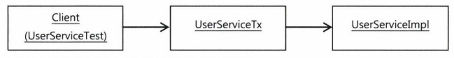

스프링의 3대 기반기술
AOP
IoC/DI
서비스 추상화

AOP를 바르게 이용하려면 OOP를 대체하려고 하는 것처럼 보이는
AOP의 필연적인 등장배경과 스프링이 그것을 도입한 이유
그 적용을 통해 얻을 수 있는 장점이 무엇인지

스프링에 적용된 가장 인기있는 AOP의 적용 대상은 선언적 트랜잭션 기능

트랜잭션 경계설정 기능
앞장에서 서비스 추상화를 통해 문제를 해결했는데
이번장에서 AOP를 이용해 더욱 깔끔한 방식으로 바꿔보자

### 트랜잭션 코드의 분리
UserService
서비스 추상화 기법
트랜잭션 기술에 독립적으로 만들어줌

트랜잭션 경계설정을 위해 넣은 코드가 찜찜함
비즈니스 로직이 주인이어야 할 메서드 안에 트랜잭션 코드가 너무 많은 자리를 차지하고 있음

#### 메서드 분리
현재 코드의 특징
- 트랜잭션 경계설정의 코드와 비즈니스 로직 코드 간에 서로 주고받는 정보가 없다는 점
- 비즈니스 로직 코드에서 직접 DB를 사용하지 않기 때문에 트랜잭션 준비 과정에서 만들어진 DB 커넥션을정보등을 직접 참조할 필요가 없기 때문!
- 이 메서드에서 시작된 트랜잭션 정보는 트랜잭션 동기화 방법을 통해 DAO가 알아서 활용함

=> 두 가지 코드는 성격이 다름 + 서로 주고받는 것도 없음 = 완벽히 독립적인 코드

비즈니스 로직을 담당하는 코드가 트랜잭션의 시작과 종료 작업 사이에 수행돼야 한다는 사항만 지키면 됨

* 트랜잭션 코드를 UserService 클래스 밖으로 뽑아내자

### DI 적용을 이용한 트랜잭션 분리
그런데 UserService에서 트랜잭션 코드를 빼버리게 되면 UserService를 이용하는 클라이언트에서는
트랜잭션 기능이 빠진 UserService를 사용하게 될 것이다..
구체적인 구현 클래스를 직접 참조하는 경우의 전형적인 단점이다

직접 사용하는 것이 문제가 된다면 간접적으로 사용하면 된다
DI의 기본 아이디어 : 실제 사용할 오브젝트의 클래스 정체는 감춘 채 인터페이스를 통해
간접으로 접근한다
구현 클래스는 얼마든지 외부에서 변경가능

우선 UserService클래스와 그 사용 클라이언트 간의 강한 결합도를 약하게 만들자
UserService를 인터페이스로 만들고 기존 코드는 UserService 인터페이스의 구현 클래스에 만들어 넣자

보통 이렇게 인터페이스를 이용해 구현 클래스를 클라이언트에 노출하지 않고 런타임시에 DI를 통해
적용하는 방법을 쓰는 이유는 일반적으로 구현 클래스를 바꿔가면서 사용하기 위해서다

테스트때는 필요에 따라 테스트 구현 클래스를
정식운영때는 정규 구현 클래스를 DI해주는 방법처럼 한번에 한가지 클래스를 선택해서 적용하도록 되어있다

하지만 꼭 그럴 필요는 없음. 한 번에 두개의 UserService 인터페이스 구현 클래스를 동시에 이용할 수 있다.

### 분리된 트랜잭션 기능
비즈니스 트랜잭션 처리를 담은 UserServiceTx
비즈니스 로직에 대해서는 관여하지 않고 같은 인터페이스인 UserService를 구현한 다른 오브젝트에게
고스란히 작업을 위임한다.
```java
public class UserServiceTx implements UserService {
    UserService userService;

    public void setUserService(UserService userService){
        this.userService = userService; // UserService를 구현한 다른 오브젝트를 DI받음
    }

    public void add(User user){
        userService.add(user);
    }

    public void upgradeLevels(){
        userService.upgradeLevels();
    }
}
```

UserService 인터페이스를 구현했으니,
클라이언트에 대해 UserService 타입 오브젝트 하나로서 행세할 수 있음

UserServiceTx는 사용자 관리라는 비즈니스 로직을 전혀 갖지 않음
고스란히 다른 UserService 구현 오브젝트에 기능을 위임함
=> 이를 위해 UserService오브젝트를 DI받을 수 있도록 만든다

이제 트랜잭션 경계설정 코드를 넣으면 된다
추상화된 트랜잭션 구현 오브젝트를 DI받을 수 있도록 PlatformTransactionManager 타입의 프로퍼티를 추가하자

### 트랜잭션 적용을 위한 DI설정
클라이언트가 UserService라는 인터페이스를 통해 사용자 관리 로직을 이용하려고 할 때
먼저 트랜잭션을 담당하는 오브젝트가 사용돼서 트랜잭션에 관련된 작업을 진행해주고,
실제 사용자 관리 로직을 담은 오브젝트가 이후에 호출돼서 비즈니스 로직에 관련된 작업을 수행하도록 만든다

의존관계는 다음과 같다.



이제 클라이언트는 UserServiceTx 빈을 호출해서 사용하고, userServiceTx는 userServiceImpl빈을 DI한다.

### 트랜잭션 분리에 따른 테스트 수정
인터페이스라 하더라도 @Autowired로 가져오는데는 문제가 없다

@Autowired는 기본적으로 타입이 일치하는 빈을 찾아주기 때문에 다른 문제가 발생함.
타입이 일치하는 거로는 두개가 발견될 것이기 때문이다.

이경우 스프링은 어떤 빈을 가져올까?
@Autowired는 기본적으로 타입을 이용해 빈을 찾지만 타입으로 하나의 빈을 결정할 수 없는 경우에는
필드이름을 이용해 빈을 찾는다

즉,
```java
@Autowired
UserService userService;
// 이 경우 UserService타입이면서 아이디가 userService인 빈이 주입될 것이다.
```

UserService 테스트 코드
- 필요한 빈
  - UserService 빈
  - UserServiceImpl  

MailSender 목 오브젝트를 이용한 테스트에서는
테스트에서 직접 MailSender를 DI해줘야했음(수동 DI)
그러려면 DI해줄 대상을 구체적으로 알고 있어야 하기 때문에 UserServiceImpl클래스의 오브젝트를 가져올 필요가 있다

### 트랜잭션 경계설정 코드 분리의 장점
트랜잭션 경계설정 코드의 분리와 DI를 통한 연결은 복잡하고, 큰 개선 작업이지만 얻을 수 있는 장점들이 있다.

1. 비즈니스 로직을 담당하고 있는 UserServiceImpl 코드 작성시에는 트랜잭션과 같은 기술적인 내용에는 신경쓰지 않아도 됨. 트랜잭션 적용이 필요한지도 신경쓰지 않아도 됨. JDBC나 JTA같은 로우레벨의 트랜잭션 API는 물론
스프링의 트랜잭션 추상화 API조차 필요 없음.
트랜잭션은 DI를 이요해 UserServiceTx와 같은 트랜잭션 기능을 가진 오브젝트가 먼저 실행되도록 만들기만 하면 됨
따라서 언제든지 트랜잭션 도입가능.

2. 비즈니스 로직에 대한 테스트를 손쉽게 만들어 낼 수 있다

## 고립된 단위 테스트
가장 편하고 좋은 테스트 방법은 가능한 한 작은 단위로 쪼개서 테스트하는 것

* 작은 단위의 테스트가 좋은 이유 ?
- 테스트 실패시 원인을 찾기 쉬움
- 테스트의 의도나 내용이 분명해짐
- 만들기 쉬움

하지만 작은 단위로 테스트하고 싶어도 그럴 수 없는 경우가 많음.
테스트 대상이 다른 오브젝트와 환경에 의존하고 있다면 작은 단위의 테스트가 주는 장점을 얻기 힘들다.

### 복잡한 의존관계 속의 테스트
UserService라는 테스트 대상이 테스트 단위인 것처럼 보이지만 사실은 그 뒤의 의존관계를 따라
등장하는 오브젝트와 서비스, 환경 등이 모두 합쳐져 테스트 대상이 되는 것이다.

한 예로, DB가 함께 동작해야 하는 테스트는 작성하기 힘든 경우도 많다.
UserDao에서 사용하는 SQL이 여러 개의 테이블을 조인하고, 복잡한 조건을 갖고 있고,
통계 계산을 해서 가져오는 경우라고 해보자.

이 DAO의 메서드가 수행돼서 테스트에 필요한 정보를 UserService가 사용하게 하려면
DAO를 위해 복잡한 테스트데이터를 준비해야한다.
그런데 막상 UserService는 가져온 목록을 가지고 간단한 계산을 하는게 전부라면 ?
배보다 배꼽이 더 큰 작업..

#### 테스트 대상 오브젝트 고립시키기
테스트의 대상이 환경이나, 외부 서버, 다른 클래스의 코드에 종속되고 영향을 받지 않도록
고립시킬 필요가 있다

테스트를 의존대상으로부터 분리해서 고립시키는 방법은 테스트를 위한 대역을 사용하는 것이다.
그런데 앞서 UserDao는 스텁이 아니라 목 오브젝트로 만들었다.
( 스텁은 단지 테스트 대상의 코드가 정상적으로 수행되도록 도와주기만 함.
  여기에 부가적인 검증 기능까지 가지는 것이 목 오브젝트)

UserServiceImpl의 upgradeLevels() 메서드는 리턴 값이 없는 void형
따라서 메서드를 실행하고 그 결과를 받아서 검증하는 것이 아예 불가능이다

upgradeLevels()는 DAO를 통해 필요한 정보를 가져와, 일정한 작업을 수행하고
그 결과를 다시 DAO를 통해 DB에 반영한다. 따라서 그 코드의 동작이 바르게 됐는지 확인하려면
결과가 남아있는 DB를 직접 확인할 수 밖에 없다
따라서 기존 테스트 코드에서는 UserService의 메서드를 실행시킨 후에
UserDao를 이용해 DB에 들어간 결과를 가져와 검증하는 방법을 사용했다

그런데 의존 오브젝트나 외부 서비스에 의존하지 않는 고립된 테스트 방식으로 만든
UserServiceImpl은 아무리 그 기능이 수행돼도 그 결과가 DB등을 통해서 남지 않으니
기존의 방법으로는 작업 결과를 검증하기 힘들다. upgradeLevels()처럼 결과가 리턴되지 않는 경우에는
더더욱 그렇다..

따라서 이럴 땐 테스트 대상인 UserServiceImpl과 그 협력 오브젝트인 UserDao에게 어떤 요청을 했는지를
확인하는 작업이 필요하다

테스트 중에 DB에 결과가 반영되지는 않았지만, UserDao의 update()메서드를 호출하는 것을 확인할 수 있다면
결국 DB에 그 결과가 반영될 것이라고 결론 내릴 수 있기 때문이다..!

UserDao와 같은 역할을 하면서 UserServiceImpl과의 사이에서 주고받은 정보를 저장해뒀다가,
테스트의 검증에 사용할 수 있게 하는 목 오브젝트를 만들어보자.

#### 고립된 단위 테스트 활용
다섯 단계 작업으로 구성된 테스트다.
1. 테스트 실행 중에 UserDao를 통해 가져올 테스트용 정보를 DB에 넣는다
  UserDao는 결국 DB를 이용해 정보를 가져오기 때문에 최후의 의존대상인 DB에 직접 정보를 넣어줘야 함

2. 메일 발송 여부를 확인하기 위해 MailSender 목 오브젝트를 DI해준다 ( 테스트를 고립시키기 위한 준비 )

1, 2 => 의존 오브젝트가 테스트 목적에 맞게 동작하도록 준비하는 과정

3. 실제 테스트 대상인 userService의 메서드를 실행한다

4. 결과가 DB에 반영됐는지 확인하기 위해 UserDao를 이용해 DB에서 데이터를 가져와 결과를 확인한다

5. 목 오브젝트를 통해 UserService에 의한 메일 발송이 있었는지 확인하면 된다
  -> 메일 서버까지 갈 필요없이 목 오브젝트를 통해 메서드가 실행되는 중에 메일 발송 요청이 나간적이 있는지만 확인

4, 5 => 실행 후에 결과를 확인하는 작업

#### UserDao 목 오브젝트
UserDao와 DB까지 직접 의존하고 있는 1번과 4번의 테스트 방식도
목 오브젝트를 만들어서 적용해보자

목 오브젝트는 기본적으로 스텁과 같은 방식으로 테스트 대상을 통해 사용될 때 필요한 기능을 지원해줘야함.

먼저,
upgradeLevels() 메서드가 실행되는 중에 UserDao와 어떤 정보를 주고받는지 입출력 내역을 확인해보자
- userDao.getAll(); // 업그레이드 후보 사용자 목록을 가져올 때
    - 목록을 리턴하므로 DB에서 읽어온 것처럼 미리 준비된 사용자 목록을 제공해줘야 한다.
- userDao.update(user); // 수정된 사용자 정보를 DB에 반영할 때
    - 리턴값이 없으므로 따로 준비할 건 없다.
    - 그러나, update() 메서드의 사용 자체가 upgradeLevels()의 핵심 로직인
      '전체 사용자 중에서 업그레이드 대상자는 레벨을 변경해준다'에서
      '변경'에 해당하는 부분을 검증할 수 있는 중요한 기능이다

## `MockUserDao`
따라서, getAll()에 대해서는 스텁으로서,
      update()에 대해서는 목 오브젝트로서 동작하는 UserDao 타입의 테스트 대역이 필요하다


* 인터페이스를 구현하려면 인터페이스 내의 모든 메서드를 만들어줘야 한다는 부담이 있다
사용하지 않을 메서드도 구현해줘야 한다면 UnsupportedOperationException을 던지도록 만드는 게 좋다
( 빈 채로 두거나 null을 리턴해도 문제는 없다. )
하지만 실수로 사용될 위험이 있으므로 UnsupportedOperationException을 던지게 해서 지원하지 않는 기능
이라는 예외가 발생하도록 만들자.

* 두 개의 User 타입 list를 정의해두었다.
  - 하나는 생성자를 통해 전달받은 사용자 목록을 저장해뒀다가, getAll() 메서드가 호출되면
    DB에서 가져온 것처럼 돌려주는 용도.
  - 다른 하나는 update()메서드를 실행하면서 넘겨준 업그레이드 대상 User오브젝트를 저장해뒀다가
    검증시에 돌려주기 위한 용도.
    => upgradeLevels() 메서드가 실행되는 동안 업그레이드 대상으로 선정된 사용자가 어떤 것인지 확인하는데 쓰임

테스트 대역 오브젝트를 이용해 고립된 테스트로 만들기 전에는
테스트 대상을 스프링 컨테이너에서 @Autowired 를 통해 가져왔다.
컨테이너에서 가져온 UserService오브젝트는 DI를 통해서 많은 의존 오브젝트와 서비스, 외부 환경에 의존하고 있었음
이제는 완전히 고립돼서 테스트만을 위해 독립적으로 동작하는 테스트 대상을 사용할 것이기 때문에
스프링 컨테이너에서 빈을 가져올 필요가 없다

1
먼저 테스트하고 싶은 로직을 담은 클래스인 UserServiceImpl 의 오브젝트를 직접 생성

* 스프링의 테스트 컨텍스트를 이용하기 위해 도입한 @RunWith 는
-> 스프링으로부터 가져온 빈을 가지고 테스트하기 위해 쓴 것
* 테스트용 사용자 정보를 DB에 등록하는 등의 번거로운 준비작업도 필요 없다.

2
준비해둔 MockUserDao 오브젝트를 사용하도록 수동 DI해준다.
이미 고립된 테스트가 가능하도록 준비해뒀던 MockMailSender도 수정자 메서드를 이용해 DI해준다

3
테스트 대상인 UserServiceImpl오브젝트의 메서드를 실행시킨다

4
검증
MockUserDao로부터 update()가 호출될 때 전달받은 사용자 목록을 가져온다.
update() 메서드를 호출해서 변경을 시도한 것만 확인하면 된다

#### 테스트 수행 성능의 향상
테스트 수행 시간은 DB까지 연동했던 때보다 빨라졌다.
JUnit의 실행시간을 확인해보면 고립된 테스트로 만든 upgradeLevels() 테스트는 0.000초가 나온다

JUnit의 테스트 시간 측정을 위한 최소 단위가 0.001초인데 그보다 더 짧은 시간에 테스트가 모두 실행됐다는 뜻

#### 단위 테스트와 통합 테스트
하나의 단위에 초점을 맞춘 테스트다

단위 테스트 : 테스트 대상 클래스를 목 오브젝트 등의 테스트 대역을 이용해
의존 오브젝트나 외부의 리소스를 사용하지 않도록 고립시켜서 테스트하는 것

통합 테스트 : 두 개 이상의, 성격이나 계층이 다른 오브젝트가 연동하도록 만들어 테스트하거나,
외부의 DB나 파일, 서비스 등의 리소스가 참여하는 테스트
즉, 두 개 이상의 단위가 결합해서 동작하면서 테스트가 수행되는 것
스프링의 테스트 컨텍스트 프레임워크를 이용해서 컨텍스트에서 생성되고 DI된 오브젝트를 테스트하는 것도 통합테스트

가이드라인 ( 단위 테스트와 통합 테스트 중 어떤 방법을 쓸지 )
- 항상 단위 테스트를 먼저 고려한다
- 하나의 클래스나 성격과 목적이 같은 긴밀한 클래스 몇 개를 모아서 외부와의 의존관계를 모두 차단하고
  필요에 따라 스텁이나 목 오브젝트 등의 테스트 대역을 이용하도록 테스트를 만든다.
  단위 테스트는 테스트 작성도 간단하고 실행 속도도 빠르며 테스트 대상 외의 코드나 환경으로부터
  테스트 결과에 영향을 받지도 않기 때문에 가장 빠른 시간에 효과적인 테스트를 작성하기에 유리함.
- 외부 리소스를 사용해야만 가능한 테스트는 통합 테스트로 만든다
- 단위 테스트로 만들기가 어려운 코드도 있음. 대표적인게 DAO.
  DAO는 그 자체로 로직을 담고 있다기 보다는 DB를 통해 로직을 수행하는 인터페이스와 같은 역할을 함.
  SQL을 JDBC를 통해 실행하는 코드만으로는 고립된 테스트를 작성하기가 힘들다
  작성한다고 해도 가치가 없는 경우가 대부분.
  따라서 DAO는 DB까지 연동하는 테스트로 만드는 편이 효과적임. DB를 사용하는 테스트는 DB에 테스트데이터를
  준비하고, DB에 직접 확인을 하는 등의 부가적인 작업이 필요함
- DAO 테스트는 DB라는 외부 리소스를 사용하기 때문에 통합 테스트로 분류된다
  하지만 코드에서 보자면 하나의 기능 단위를 테스트하는 것이기도 함.
  DAO를 테스트를 통해 충분히 검증해두면, DAO를 이용하는 코드는 DAO역할을 스텁이나 목 오브젝트로 대체해서
  테스트할 수 있다. 이후에 실제 DAO를 이용하는 코드는 DAO역할을 스텁이나 목 오브젝트로 대체해서
  테스트 할 수 있다. 이후에 실제 DAO와 연동했을 때도 바르게 동작하리라고 확신할 수 있다.
  물론 각각의 단위 테스트가 성공했더라도 여러 개의 단위를 연결해서 테스트하면 오류가 발생할 수도 있다.
  하지만 충분히 단위 테스트를 거친다면 통합 테스트에서 오류가 발생할 확률도 줄어들고 발생한다고 하더라도
  쉽게 처리할 수 있다.
- 여러 개의 단위가 의존관계를 가지고 동작할 때를 위한 통합 테스트는 필요하다
  다만, 단위 테스트를 충분히 거쳤다면 통합 테스트의 부담은 상대적으로 줄어든다.
- 단위 테스트를 만들기가 너무 복잡하다고 판단되는 코드는 처음부터 통합 테스트를 고려해본다
  이때도 통합 테스트에 참여하는 코드 중에서 가능한 한 많은 부분을 미리 단위 테스트로 검증해두는 게 유리하다
- 스프링 테스트 컨텍스트 프레임워크를 이용하는 테스트는 통합테스트다.
  가능하면 스프링의 지원없이 직접 코드레벨의 DI를 사용하면서 단위 테스트를 하는 게 좋겠지만
  스프링의 설정 자체도 테스트 대상이고, 스프링을 이용해 좀 더 추상적인 레벨에서 테스트 해야 할 경우도 종종있다.
  이럴 땐 스프링 테스트 컨텍스트 프레임워크를 이용해 통합 테스트를 작성한다.

테스트는 코드가 작성되고 빠르게 진행되는 편이 좋다.
테스트를 먼저 만들어두는 TDD는 코드를 만들자마자 바로 테스트가 가능하다는 장점이 있다
테스트를 코드를 작성한 후에 만드는 경우에도 가능한 한 빨리 작성하도록 해야 한다.
코드를 만들고 오랜 시간이 지난 뒤에 작성하는 테스트는 테스트 대상 코드에 대한 이해가 떨어지기 때문에
불완전해지기 쉽고 작성하기도 번거롭다

코드를 작성하면서 테스트는 어떻게 만들 수 있을까를 생각해보는 것은 좋은 습관이다
테스트하기 편하게 만들어진 코드는 깔끔하고 좋은 코드가 될 가능성이 높다

만약 DI도 사용하지 않고, 비즈니스 로직과 로우레벨의 기술과, 외부 환경과 성격이 다른 데이터 액세스 기능들이
한데 모여 강하게 결합되어 있는 코드였다면, 과연 이런 테스트를 만들수나 있었을까?

### 목 프레임워크
단위 테스트를 만들기 위해서는 스텁이나 목 오브젝트의 사용이 필수적
의존관계가 없는 단순한 클래스나 세부 로직을 검증하기 위해 메서드 단위로 테스트 할 때가 아니라면,
대부분 의존 오브젝트를 필요로 하는 코드를 테스트하게 된다.

단위 테스트가 많은 장점이 있고 가장 우선시해야 할 테스트 방법인 건 사실이지만 작성이 번거롭다
특히 목 오브젝트를 만드는 일이 가장 큰 짐.
MockUserDao를 만들때 이야기 했ㄷ듯이 테스트에서는 사용하지 않는 인터페이스도 모두 일일이 구현해줘야한다.
검증 기능이 있는 목 오브젝트로 만들려면, 메서드의 호출 내용을 저장했다가 이를 다시 불러오는 것도 매번 귀찮다
특히 테스트 메서드 별로 다른 검증 기능이 필요하다면, 같은 의존 인터페이스를 구현한 여러 개의 목 클래스를 선언해줘야 한다.

다행히 이런 번거로운 목 오브젝트를 편리하게 작성하도록 도와주는 다양한 목 오브젝트 지원 프레임워크가 있다.

### Mockito 프레임워크
그중에서도 Mockito라는 프레임워크는 사용하기도 편리하고, 코드도 직관적이라 인기있음

Mockito와 같은 목 프레임워크의 특징
- 목 클래스를 일일이 준비해둘 필요가 없다
  - 간단한 메서드 호출만으로 다이내믹하게 특정 인터페이스를 구현한 테스트용 목 오브젝트를 만들 수 있다.

mock() 메서드는 org.mockito.Matchers클래스에 정의된 static 메서드다.
static import를 사용해 로컬 메서드처럼 호출하게 하자.
```java
UserDao mockUserDao = mock(UserDao.class);
```

getAll() 메서드가 불려올 때 사용자 목록을 리턴하도록 스텁기능을 추가해보자
```java
when(mockUserDao.getAll()).thenReturn(this.users);
```

mockito를 통해 만들어진 목 오브젝트는 메서드의 호출과 관련된 모든 내용을 자동으로 저장해두고, 이를
간단한 메서드로 검증할 수 있게 해준다

Mockito 목 오브젝트는 다음의 네 단계를 거쳐서 사용하면 된다
- 인터페이스를 이용해 목 오브젝트를 만든다
- 목 오브젝트가 리턴할 값이 있으면 이를 지정해준다. 메서드가 호출되면 예외를 강제로 던지게 만들 수 있다
- 테스트 대상 오브젝트에 DI해서 목 오브젝트가 테스트 중에 사용되도록 만든다
- 테스트 대상 오브젝트를 사용한 후에 목 오브젝트의 특정 메서드가 호출됐는지,
  어떤 값을 가지고 몇번 호출됐는지를 검증한다.


## `Mockito를 적용한 테스트 코드`
```java

@Test
public void mockUpgradeLevels() throws Exception {
    UserServiceImpl userServiceImpl = new UserServiceImpl();

    UserDao mockUserDao = mock(UserDao.class);
    when(mockUserDao.getAll()).thenReturn(this.users);
    userServiceImpl.setUserDao(mockUserDao);

    MailSender mockMailSender = mock(MailSender.class);
    userServiceImpl.setMailSender(mockMailSender);

    userServiceImpl.upgradeLevels();

    verify(mockUserDao, times(2)).update(any(User.class));
    verify(mockUserDao, times(2)).update(any(User.class));
    verify(mockUserDao).update(users.get(1));
    // users.get(1)을 파라미터로 update()가 호출된 적이 있는지 확인해줌.
    // update()가 아예 호출된 적 없거나 파라미터가 users.get(1)이 아니었다면 테스트는 실패한다.

    assertThat(users.get(1).getLevel(), is(Level.SILVER));
    verify(mockUserDao).update(users.get(3));
    assertThat(users.get(3).getLevel(),is(Level.GOLD));

    ArgumentCaptor<SimpleMailMessage> mailMessageArg =        ArgumentCaptor.forClass(SimpleMailMessage.class);
    verify(mockMailSender, times(2)).
}
```
UserDao의 목 오브젝트를 생성하고 getAll()이 호출됐을 때의 리턴 값을 설정해준 뒤
테스트 대상에 DI 해줌.
UserDao 인터페이스를 구현해서 목 클래스를 따로 정의할 필요도 없이 매우 간단한 코드 몇 줄로
목 오브젝트의 준비가 끝난다.
MailSender도 따로 목 클래스를 정의할 필요가 없다
Mockito를 이용해 간단히 목 오브젝트를 생성해서 DI 해주면 됨.
목 오브젝트는 준비는 끝났고, DI를 마친 userServiceImpl오브젝트는 이제 고립된 테스트가 가능

userServiceImpl메서드가 실행되는 동안 DI 해준 목 오브젝트의 메서드가 호출되면 자동으로 
호출기록이 남겨진다
getAll() 처럼 미리 설정해둔 리턴 값이 있는 경우에는 그 값을 그대로 리턴해주기로 한다.

다음은 목 오브젝트의 메서드가 어떻게 호출됐는지 검증할 차례
times()는 메서드 호출 횟수를 검증해줌.
any()를 사용하면 파라미터의 내용은 무시하고 호출 횟수만 확인할 수 있음
호출 횟수 검사가 끝나면 목 오브젝트가 호출됐을 때의 파라미터를 하나씩 점검한다

이 테스트에서 확인하고 싶은 사항은 UserDao의 update() 메서드가 두 번 호출됐고,
그때의 파라미터는 getAll()에서 넘겨준 User목록의 두 번째와 네 번째여야 한다는 것이다.
verify
